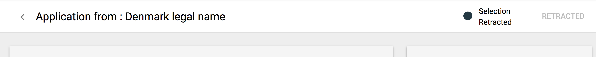

# Application's Assessment

## Reviewing list of submitted applications

As a reviewer, Focal Point or person with appropriate permissions, user can reject or add an application to preselected list and download Concept Note directly from the list. Rejecting and preselecting is possible per application \(when user hovers over the row in a table, icons are displayed\) or for more than one application \(by selecting checkbox and using icons displayed in a table's header\):

## Reviewing application details

To view application's details, user needs to click on Application ID. The following screen will be displayed:

User has an option to view profile summary and go to profile details \(link on the bottom of Profile summary card\), download a Concept Note and provide optional feedback in Comments section of this screen.

## Adding applications to Preselected list

Applications added to Preselected list, may be removed from there, user can download a Concept Note directly from the list. 

This list provides also information about review progress and scores added by reviewers. Important feature of this screen is an option to compare selected applications \(checkboxes selected, compare icon available in table header\).

When compare button is clicked, modal window will appear:

Applicant\(s\) can be selected from this modal window and comparison report can be downloaded.

## Adding a review of the application

When user is selected to be a reviewer for a CFEI and application deadline is reached, user needs to review all preselected applications and add scores for each. Reviewing is possible from the Application details screen - button is placed in Reviewers card, next to reviewers name.

To add a review, modal window will be opened:

Preview of added review is displayed in Reviews card with date of assessment and total score added by this reviewer. Row is expandable - scores per criteria and notes are shown. Next to Reviewers card, Average total score for this Applicant and counter of assessments is shown.

User can edit his review. Modal window is opened by clicking on edit icon:

## Selecting application\(s\)

To select an application \(or more than one\), all assessments need to be done and Partner's profile needs to be verified. User can use button in modal window when compering applications or from the screen with Application details - button is placed in the screen header \(top right\).

When Select button is clicked, modal window will appear and user will need to provide justification for this selection. Partner will be notified about selection.

When Partner is selected, status of Application changes and Retract selection button is displayed:

## Viewing results of CFEI assessment

When CFEI is Closed/Under Review and assessment is not finished, the Results tab shows as follows:

When Partner is selected, the Results tab will be showing selected Partner with option to retract selection:

## Retracting selection

Retraction can be made from Results tab in CFEI and form Application details screen \(top right of header\). If Agency user decides to retract selection for this Partner, the modal window will be displayed:

The status of Application will change in the header on Application details screen as follows:

Information about retraction with justification will be displayed also on Results tab:

When different Partner will be selected, its Legal Name will be displayed on Results page, with option to retract selection:

## Finalizing CFEI

