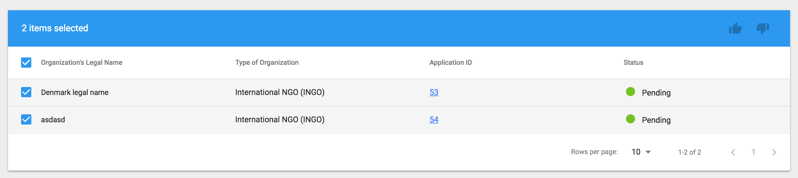

# Application's Assessment

## Applications tab

As a reviewer, Focal Point or person with appropriate permissions, user can reject or add an application to preselected list and download Concept Note directly from the list. Rejecting and preselecting is possible per application \(when user hovers over the row in a table, icons are displayed\) or for more than one application \(by selecting checkbox and using icons displayed in a table's header\):

## Application details

To view application's details, user needs to click on Application ID. The following screen will be displayed:

## Preselected list

Applications added to preselected list, may be removed from there, user can download Concept Note directly from the list. 

This list provides also information about review progress and scores added by reviewers. Important feature of this screen is option to compare selected applications \(checkboxes selected, compare icon available in table header\).

When compare button is clicked, modal window will appear:

Applicant\(s\) can be selected from this modal window and comparison can be downloaded.

## Reviewing applications

When user is selected to be a reviewer for a CFEI and application deadline is reached, user needs to review all preselected applications and add scores for each. Reviewing is possible from the Application details screen - button is placed in Reviewers card, next to reviewers name.

To add a review, modal window will be opened:

User can edit his review

## Selecting application\(s\)

To select an application \(or more than one\), user can use button in modal window when compering applications or from the screen with Application details - button is placed in the screen header \(top right\).

