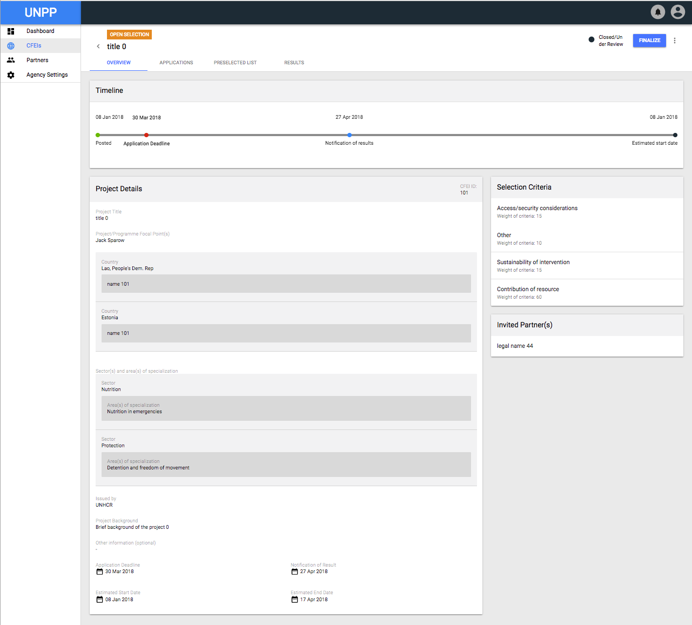
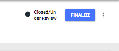
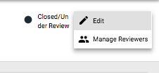
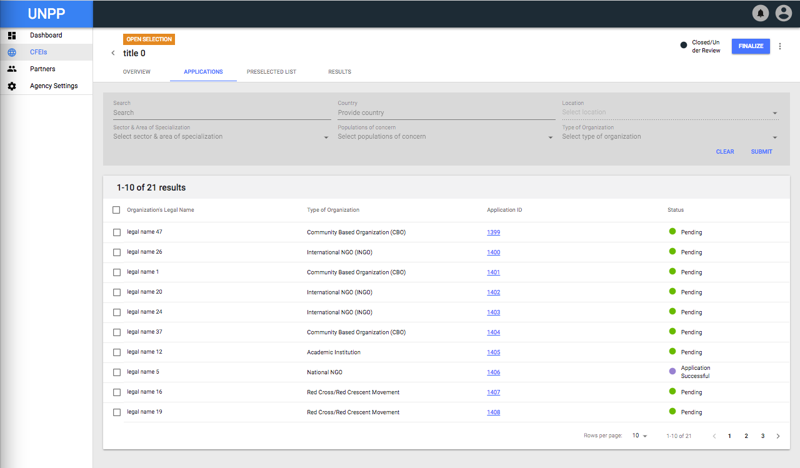
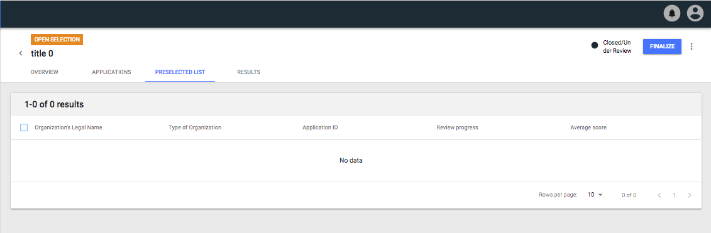
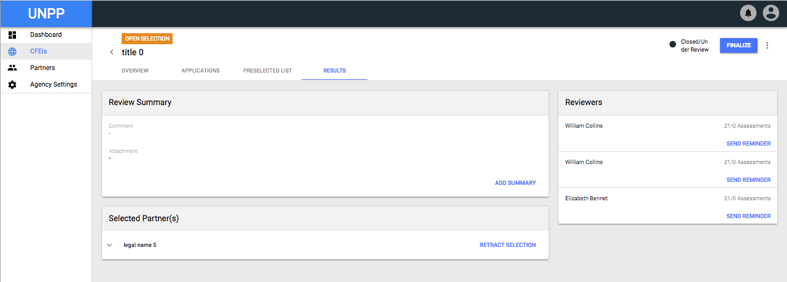
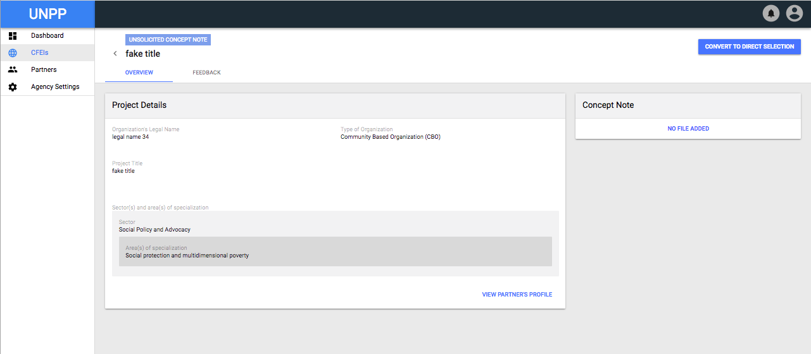
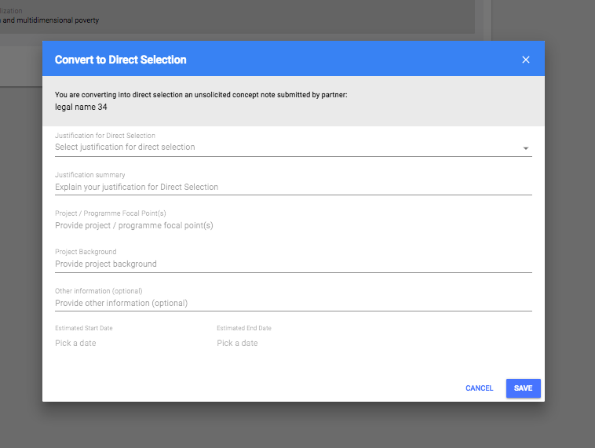
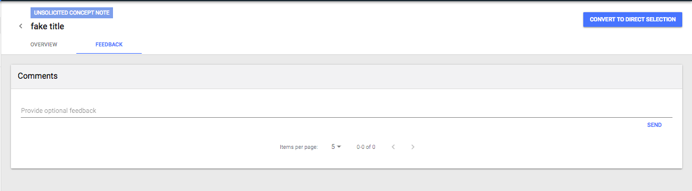

# CFEIs

Calls for Expression of Interests are live at the heart of UNPP’s Agency and Partner Relationships. This tool is key in communicating the needs for a project and the ability for UN Agency parties to identify and select the appropriate Partners for a particular Project.

## Sections

There are three main tabs that live within this section:

1. Calls for Expression of Interests
   1. A dedicated table that is filterable, displaying all current CFEIs in the System.
2. Direct Selections
   1. Similar to the previous section \(tab\) however instead of the competitive process, the Direct Selection bypasses the open selection process and allows Agency Users to reach out directly to their partners of choice.
3. Unsolicited Concept Notes

   a.     Unsolicited Concept Notes or \(UCNs\) are created and submitted by partners and are reviewed before making a partner selection for rewarding a partner the project.

### CFEI Details

Once selecting an individual CFEI from the available lists, the user will be able to dive deeper into the informations for this particular project.

On the top section of the screen, the user will be presented with a few features to help them quickly identify the category, and status of the CFEI.

A label is present just above the CFEI's **Title** to indicate if the CFEI is categorized as an "Open Selection" or not. 

Just below the **Title **sits the following list of tabs:

* Overview
* Applications
* Preselected List
* Results

#### CFEI Overview

The CFEI Overview tab displays the following features to the User:

* Timeline showing the following:
  *  Date the CFEI was posted
  * Application Deadline
  * Notifications of Results
  * Estimated Project Start Date
* Project Details
  * Project Title
  * Project Focal Point\(s\)
  * Sector and area of specialization
  * Agency in which the CFEI was issues by
  * Project Background
  * Application Deadline
  * Notification of Result
  * Estimated Start Date
  * Estimated End Date
* Selection Criteria
  * Criteria
    * Weight of Criteria
* Invited Partner\(s\)
  * Name of Partner invited to participate in CFEI

Furthermore, on the top right section of the CFEI: Overview screen, the user will be able to see the status of the CFEI with options to Finalize, Edit, and Manage Reviewers. 

#### CFEI Applications

The Second Tab on the list presents the user with an option to view a table list of  all Partner Applications for a specific CFEI.

Content displayed in the table contains the following information separated by columns:

* Organization's Legal Name
* Type of Organization
* Application ID
* Status

Featured on top of the Table List, are filters for the Agency User to quickly refine their search by the following options:

* General Text Search
* Country
* Location
* Sector & Area of Specialization
* Population of Concern
* Type of Organization

#### CFEI Preselected List

The third tab available is the "Preselected List". This is similar to the Applications List however, instead of displaying a list of Partners who have applied to the CFEI, it displays select Partners that were hand picked by Agency users to forego the Open Selection process. 

#### CFEI Results

Lastly, a section remains available to the Agency User to view high level information regarding the results of the CFEI selection process. The Agency User is able to see the following features and information for a specific CFEI:

* Review Summary
  * Comments
  * Attachments
  * Ability to Add Summary if one is not already provided.
* Selected Partner\(s\)
  * List of Partners selected for the project.
  * Ability to retract a previous selection.
* Reviewers
  * List view of Agency Reviewers and a total count of assessments made per reviewer. 
    * Agency User has the ability to send reminders to the Reviewers.

#### CFEI: Finalization

Once the process of creating an Call for Expression of Interest is made, a partner is reviewed and a selection is made, the last step is for the Agency User to Finalize the CFEI.

On the top hand corner, a button for Finalizing is available. Once clicked, a modal will appear with the following options:

* Confirm the desire to finalize the CFEI
  * Choose reason for completing CFEI
  * Add justification for completing CFEI

### Unsolicited Concept Notes

When a CFEI has been created and either made public or sent directly to a specific partner\(s\) the Partner in return provides a documentation called a Concept Note back to the Agency in order to be selected for a project. 

When viewing a list of CFEIs, the user can access a list of Unsolicited Concept Notes \(UCNs\) which display the following:

* Project Details
  * Organization's Legal Name
  * Type of Organization
  * Project Title
  * Sector and area of Specialization
* Concept Note
  * Ability to download the Concept Note the Partner has Attached.

Furthermore, the Agency User has the ability to view the partner's profile or Convert the UCN to a Direct Selection.

When Converting to a Direct Selection, a modal will appear and the user must provide the following information to proceed:

* Justification for Direct Selection
* Justification Summary
* Project / Programme Focal Point
* Project Background
* Other Information \(optional\)
* Estimated Start Date
* Estimated End Date.

The Agency User also has the ability to provide feedback for a specific UCN. By navigating to the Feedback Tab just below the UCN Title, the user will be presented with a Comments section, where they will be able to provide their feedback on the specific UCN.

