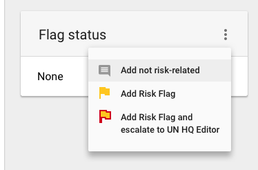
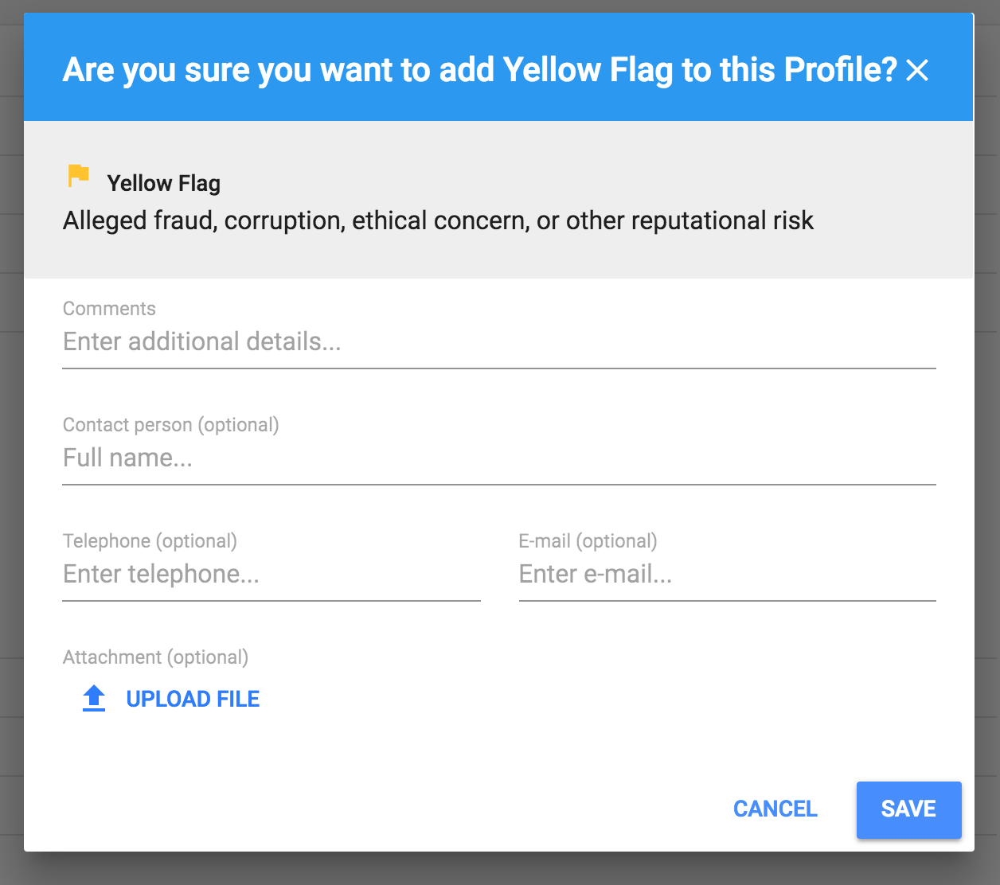
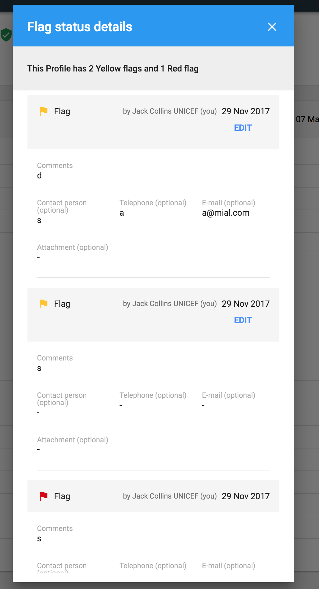
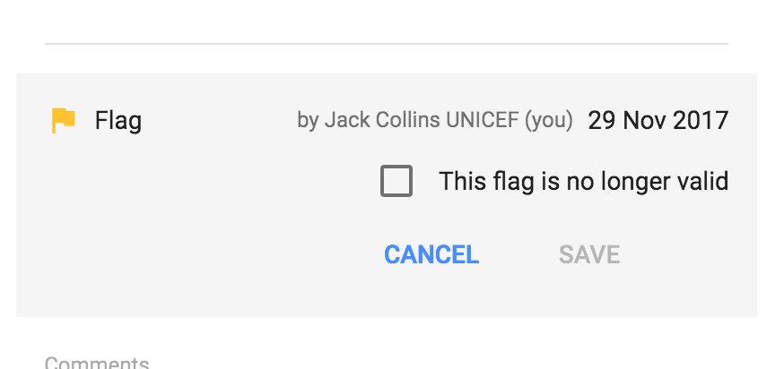

# Adding Observation to Partner's Profile

> **if PO only**

## Adding new Observation

Adding new Observation/Flag is possible from menu placed on Flag status card:

Clicking on type of the flag, following modal will be open:

Each type of Observation/Flag will be added by a separate modal window.

## Viewing added Observations

All added flags are viewable from the header and Flag Status card \(as a quick preview - number and flag icon\). To view more details, user needs to click on view details button. The following modal window will be shown:

## Editing Observation

As a creator of a flag, user can edit his observation and mark it as no longer valid:

Users can add observation to the Partner's Profile. This observation can be not risk-related or risk related \(yellow flag, escalated yellow flag\). Adding a red flag will be centralized to UN HQ. 

## Adding new Observation

Depending on permissions added to the user - for full description view **permission matrix** - users can add observation through the modal:

modal

## Viewing added Observations

All added observations will be listed in a table in Observations tab in Partner's detail section. Depending on permissions, users will be able to view number and type of observation or detailed information as well.

## Editing Observations

If a user is an owner of the added observation, he will be able to edit this observation. In case of yellow flag added by Country Office user with appropriate permissions, this user will be able to mark it as no longer valid or escalate it to UN HQ for further investigation. If a flag was differ to CO, user will be able only to mark it as no longer valid \(user cannot escalate yellow flag to UN HQ for the second time\).

## Response of HQ to escalated risk flag

HQ Editor will be able to filter escalated risk flags in the Observations tab to know which observations need his assistance. HQ Editor can view the details of this observations and can edit them. Options available here are:

* Defer back to filed for local decision making 
* Confirm/deem to be so serious that no partnership should take place with the flagged entity.

modal

