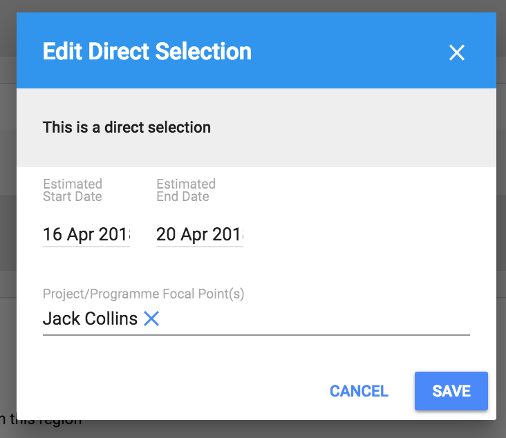
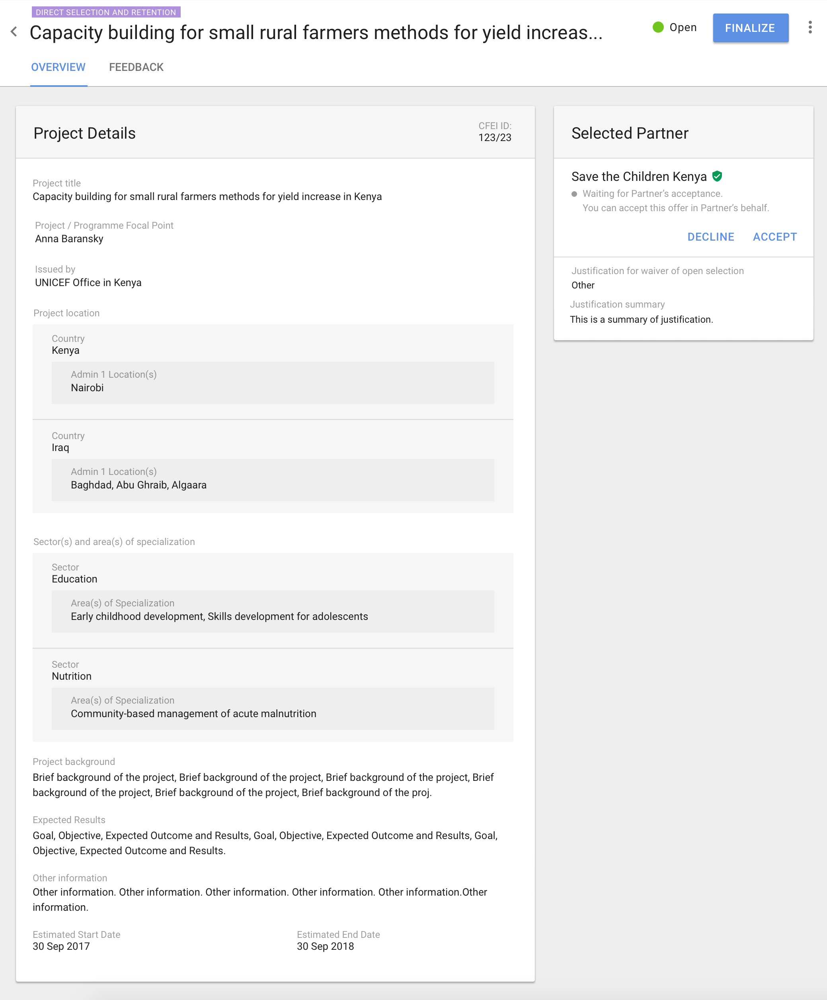
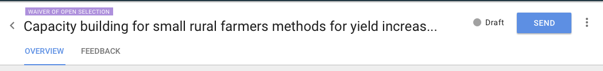
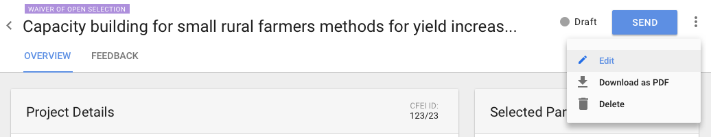
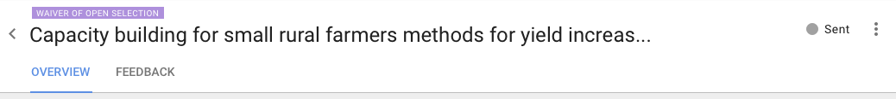
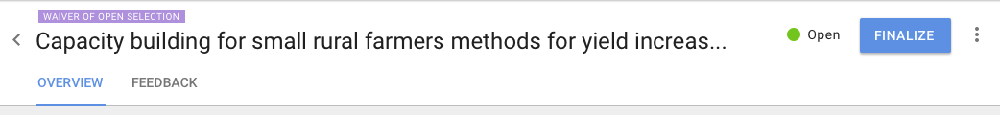
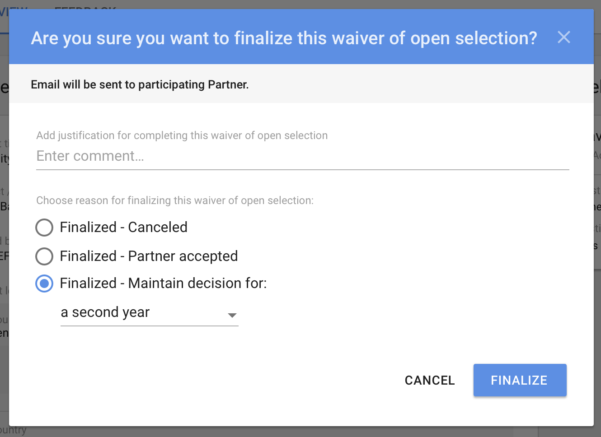
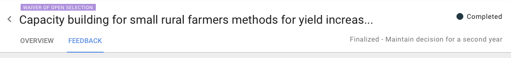

# Maintain Direct Selection

> **if only PO taken under consideration**

## Direct Selection's details

Header of this screen contains Project's Title, status and additional buttons that are different for different types of users, depending on their permissions.

Creator of this direct selection and Focal Point have a possibility to Edit and Finalize direct selection, as well as accept offer on Partner's behalf and retract selection.

While editing, the following window will appear:

In the Overview tab, user can see all details about Direct Selection, placed on cards:

* Project Details
* Selected Partner\(s\) - with possibility to accept in behalf of the Partner or to retract selection.

## Finalizing Direct Selection

Agency user with appropriate permissions can finalize Direct Selection by clicking on Finalize button, the following modal window will be displayed:

> **If CR added to the flow**

Direct Selection can be added both by Basic Editor and Advanced Editor. Basic Editor has permissions to prepare and save Direct Selection as a Draft. Publishing Direct Selection can be done only by Advanced Editor.

## Direct Selection's details

Header of this screen contains Project's Title, status and additional buttons that are different for different types of users, depending on their permissions.

In the Overview tab, user can see all details about Direct Selection, placed on cards:

* Project Details
* Selected Partner \(with information about the Partner's answer status, justification for Direct Selection and attachment if added\). 

## The flow for maintaining Waiver of Open Selection

* When Direct Selection is created, it is saved as draft by default. The status of this Direct Selection is "Draft". 

* If Direct Selection was created by Basic Editor, options available for this user are:  **Edit** - user can edit Direct Selection before it is sent do Advanced Editor. All information for Direct Selection are editable. **Download as PDF.** **Delete ** - user can delete Direct Selection before it is sent do Advanced Editor. **Send** - the main button on this screen - user can send this Direct Selection do Advanced Editor, who can publish it. The status of Direct Selection will be changed to "Sent". If Partner was selected, he won't get any notification until Direct Select is published.

* If Advanced Editor views Direct Selection, that was sent to him by Basic Editor, options available for this user are:  **Edit **- when edited and saved, the status of the Direct Selection will not change and will remain "Sent". **Publish** - the main button on this screen - user can publish this Direct Selection. The status of Direct Selection will be changed to "Open". Partner will get notification about selection.

* If Direct Selection was created by Advanced Editor, options available for this user are:  **Edit** - user can edit Direct Selection before it is published. All information for Direct Selection are editable.  **Delete **- user can delete Direct Selection before it is published. **Publish** - the main button on this screen - user can publish this Direct Selection. The status of Direct Selection will be changed to "Open". Partner will get notification about selection.

* If Direct Selection has status open, it can be finalized. Reason for finalizing Direct Selection need to be provided on the modal window that will be displayed:

