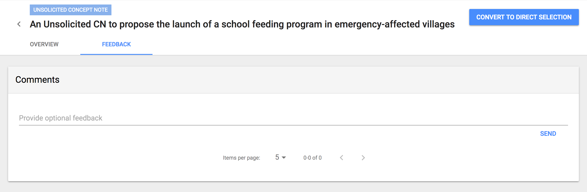
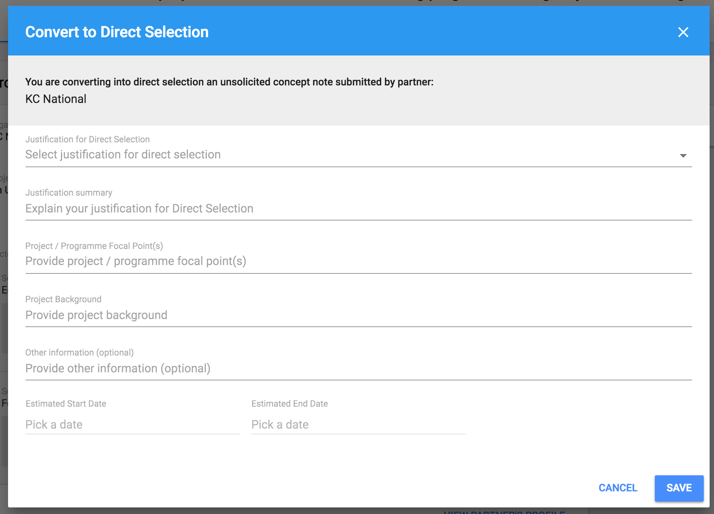

# Maintain Unsolicited Concept Note

Unsolicited Concept Note can be sent by Partner to the UN Agency and it is not connected to any CFEI published by the Agency at this point. Agency users can view Unsolicited Concept Notes from the appropriate tab in CFEIs and decide to convert it to Direct Selection or not.

## Details of Unsolicited Concept Note

From the Overview tab, Agency user can view:

* **Project Details** - these are information sent by Partner about: Organization's Legal Name Type of Organization Project Title Sector\(s\) and area\(s\) of specialization  At the bottom of this card, link to **Partner's Profile** is located. 
* **Concept Note** - option to download.

The Agency user also has the ability to provide feedback for a specific UCN. By navigating to the Feedback Tab just below the UCN Title, the user will be presented with a Comments section, where they will be able to provide their feedback on the specific UCN.

## Convert Unsolicited Concept Note to Direct Selection

When Converting to a Direct Selection, a following modal will appear and the user must provide the  information to proceed:

