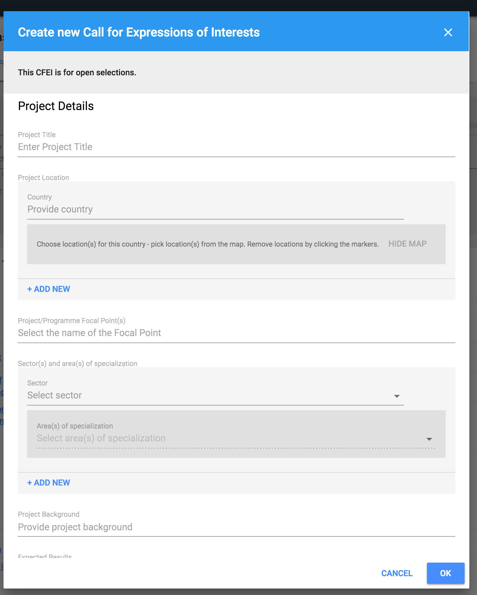
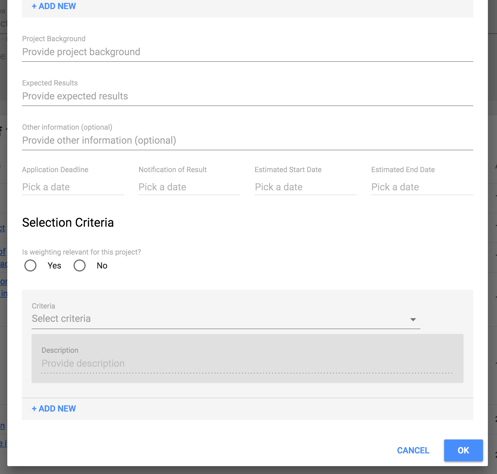
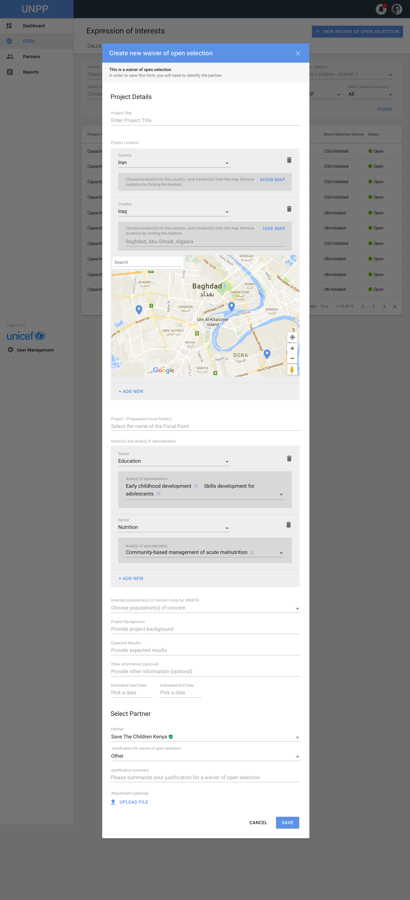

# New CFEIs set up

User can add new CFEI for:

* Calls for Expression of Interest
* Direct Selection

## New Call for Expression of Interest

To add new Call for Expression of Interest, user needs to click on the button placed in the top right of the page header - "New CFEI". The following modal window will be displayed \(all fields are required\):

New Call for Expression of Interest will be added to the list. To view and maintain any actions, user needs to click the Project Title on the list.

## New Direct Selection

To add new Direct Selection, user needs to click on the button placed in the top right of the page header - "New Direct Selection". The following modal window will be displayed \(all fields are required\):

New Direct Selection will be added to the list. To view and maintain any actions, user needs to click the Project Title on the list.

Options to choose for justification:

* Know experience
* Local presence
* Innovative approach
* Time constraints/criticality of response
* Importance of strengthening national civil society engagement
* Other
* Maintain Partner year 1
* Maintain Partner year 2
* Maintain Partner year 3
* Maintain Partner year 4

There is also possibility to add the attachment in selected Partner section. 

