# Partner Verification

UN agencies conduct Partner Verification \(due diligence\) to review a CSO’s self-reported profile data, and perform an internet search/consultation of other sources.** **User, with appropriate permissions \(UN HQ Editor, Editor Advanced\) can run new Verification at any time, from a Partner's detailed page. Button is placed in a header, under the menu located in the top right of the page.

### Restrictions

* UN HQ users can verify INGO HQ profiles. A verification performed by one UN HQ will be accepted by all other agencies.
* CSO can only be verified if their profile is complete.
* INGO COs cannot be verified if the HQ profile has not been verified.

> **without new tab**

## Viewing Verifications

User can view Verifications from Overview tab:

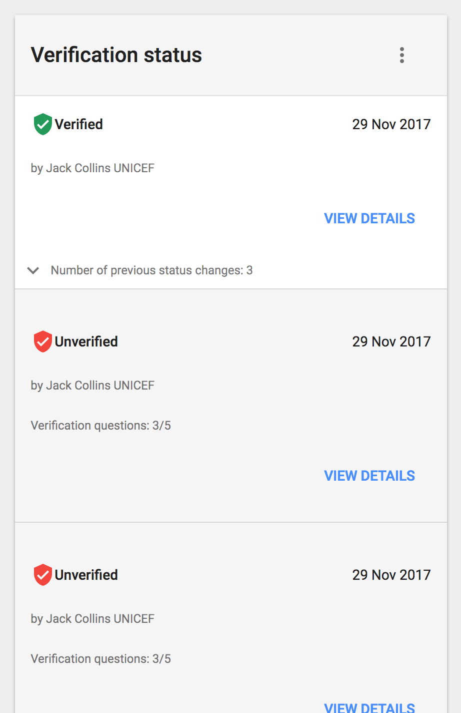

When view details button is clicked, the following modal with details will appear:

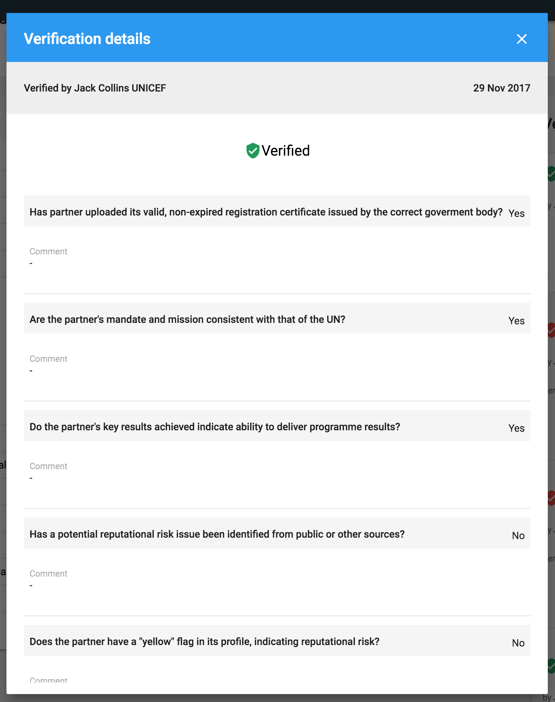

## Adding new verification

To conduct new Verification, users need to answer to the questions in the form, that is open in a modal window.

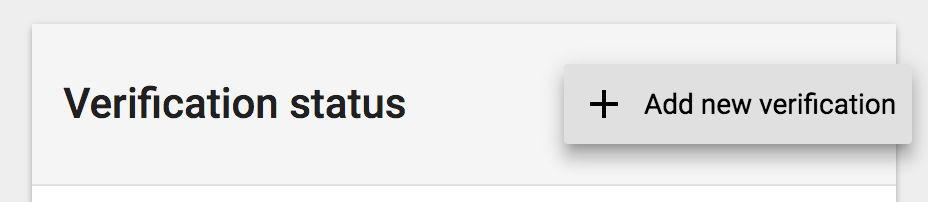

Verification form contains five questions. 

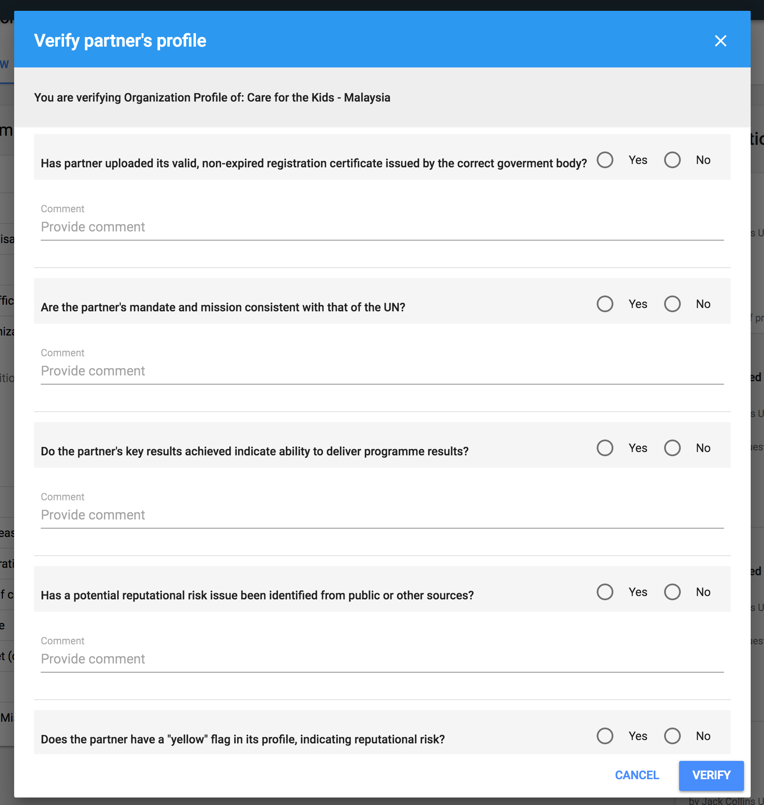

If user chooses respectively: 3x "yes" and 2x "no" partner's profile will be Verified. Otherwise - Unverified. When Verify button is clicked, one of the following modal windows will be shown:

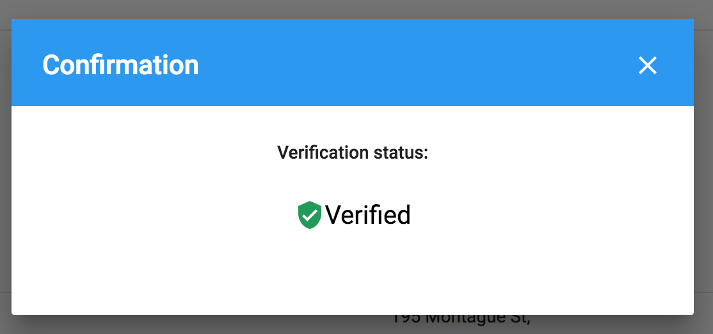

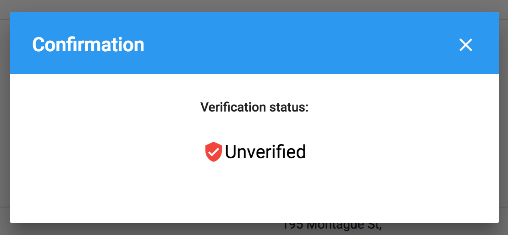

> **with new Verification tab**

## Viewing Verifications

User with appropriate permissions can view Verifications from Verifications tab:

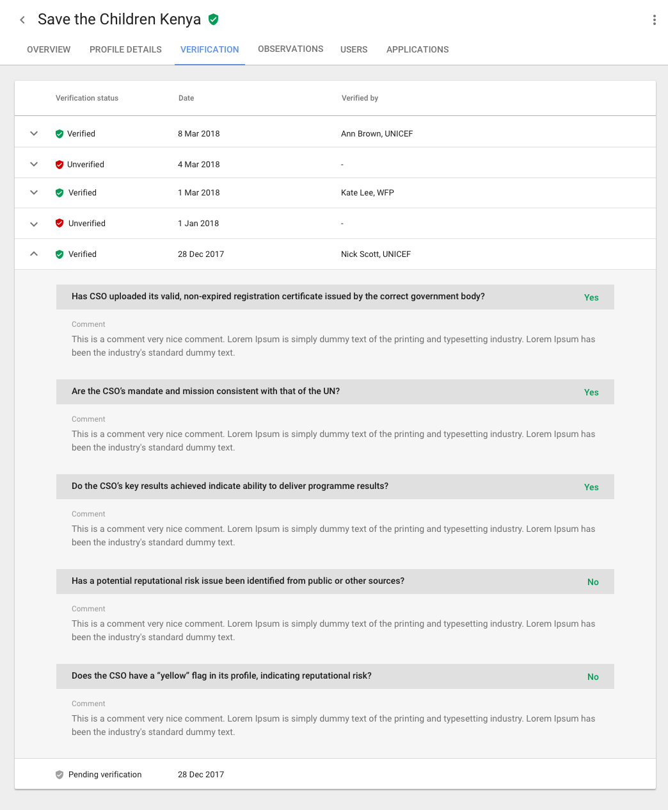

Each row is expandable and shows verification details. Table provides also information about Verification date and person who conducted this verification.

## Adding new Verification

Adding new verification is possible from header:

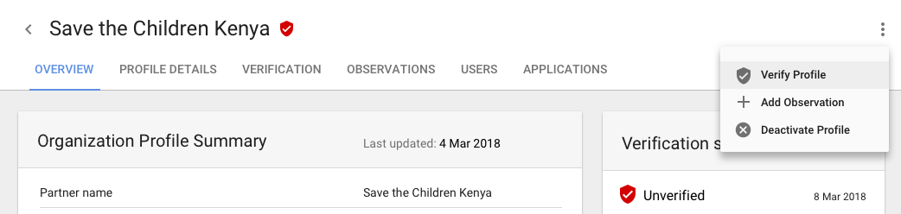

To conduct new Verification, users need to answer to the questions in the form, that is open in a modal window. Modal should contain a link to Partner's profile, which will be opened in a separate browser window. The Observations details \(information about risk flags\) will also be provided, so the users could check if any risk flags were added to the profile. To save a modal, users will need to mark a checkbox, to confirm they want to perform the action.

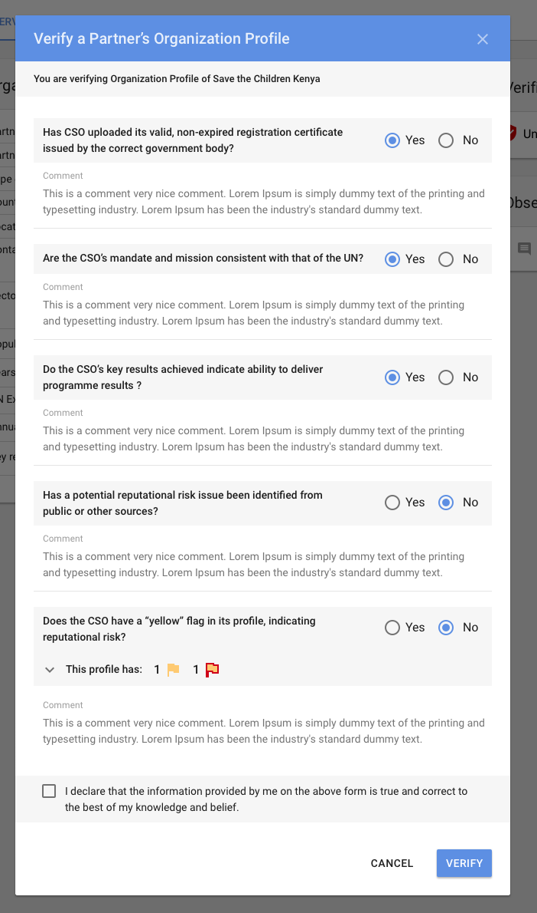

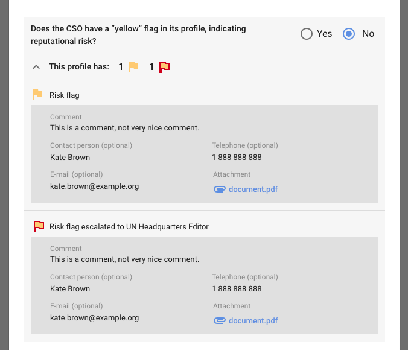

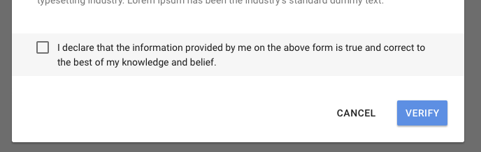

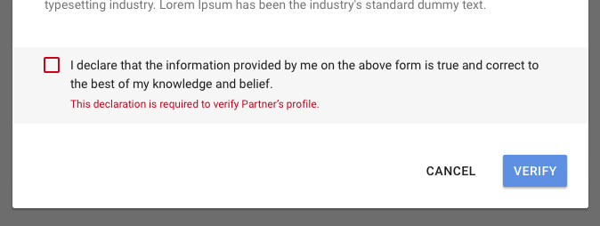

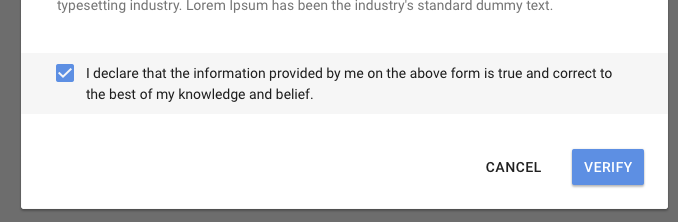

If user chooses respectively: 3x "yes" and 2x "no" partner's profile will be Verified. Otherwise - Unverified. When Verify button is clicked, one of the following modal windows will be shown:

**Available statuses of verification**: Pending, Verified, Unverified.

