# Partner's details

Partner's detail screens are possible to reach from the main Partner navigation, when selected from a list \(when the Organization's Legal Name is clicked\). 

> **only changes from PO**

Header of this screen contains Organization's Legal Name with badges indicating verification status and number of flags added to the Partner's profile.

The main page is divided by tabs:

* Overview
* Profile Details
* Users
* Applications

## Overview

On this screen user can view Profile summary with date of the last update, information about Verification status and number and type of observations added to the profile.

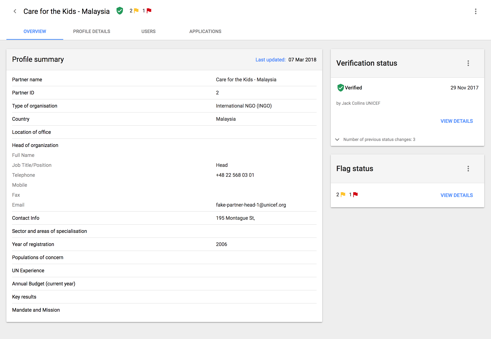

From this screen Agency user is able to run new Verification and add observation/flag to the profile.

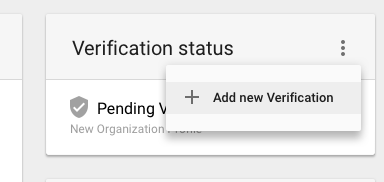

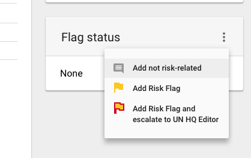

## Profile Details

This is a section with detailed information about Partner's profile in view mode.

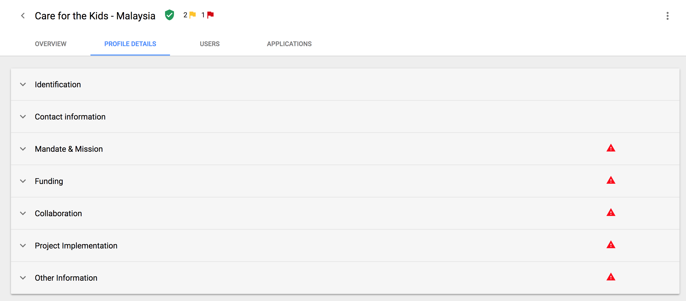

## Applications

The purpose of this screen is to show all CFEIs that Partner submitted his application for.

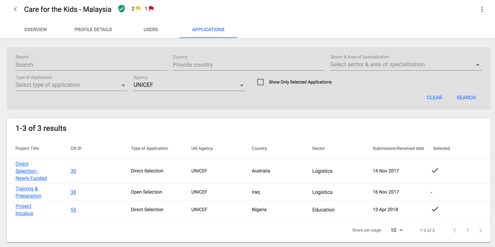

### Filters

User can filter data by:

* Search
* Country
* Sector & Area of Specialization
* Type of Application
* Agency
* checkbox to show only selected applications

### Search Results

Table provides information about:

* Project Title \(which is also a link to CFEI overview page\)
* CN ID \(which is also a link to application details page\)
* Type of Application
* UN Agency
* Country
* Sector
* Submission/Received date
* Selected

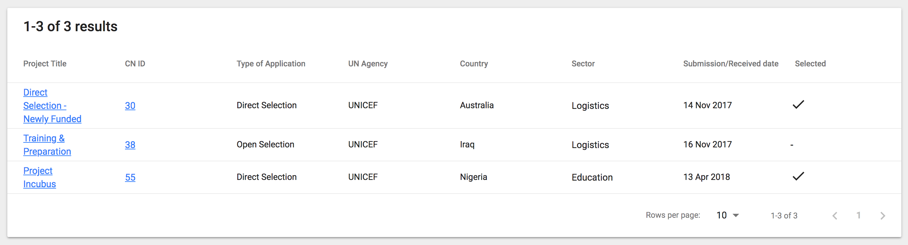

> **changes from CR?**

Header of this screen contains Organization's Legal Name with badges indicating verification status and number of flags added to the Partner's profile. In the top right corner of the page, menu is available. User can add new Observation or perform new Verification from there.

The main page is divided by tabs:

* Overview
* Profile Details
* Verification
* Observations
* Users
* Applications

## Overview

On this screen user can view Profile summary with date of the last update, information about Verification status and number and type of observations added to the profile.

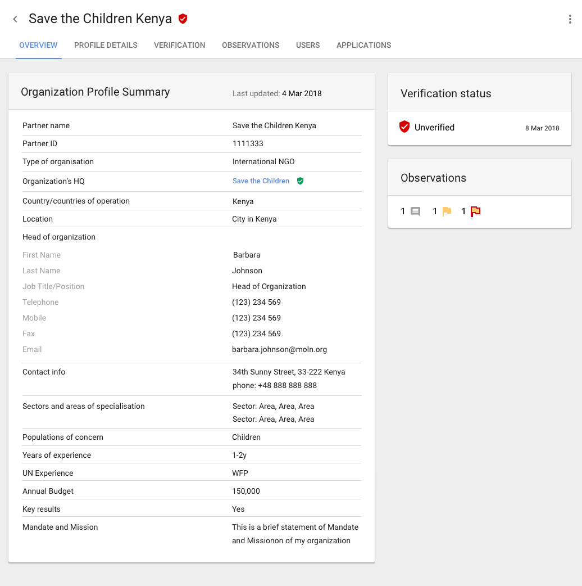

## Profile Details

This is a section with detailed information about Partner's profile in view mode.

## Verification

Screen contains a list of all verifications performed on the Partner's profile. Table provides information about Verification status, Date of verification and person, who added this verification. Rows of this table are expandable and show information about answers on verification questions.

Flow for adding new verification is described [**here**](https://unicef.gitbook.io/unpp/agencies/partner-verification).

## Observations

Screen contains a list of all observations added to the profile. 

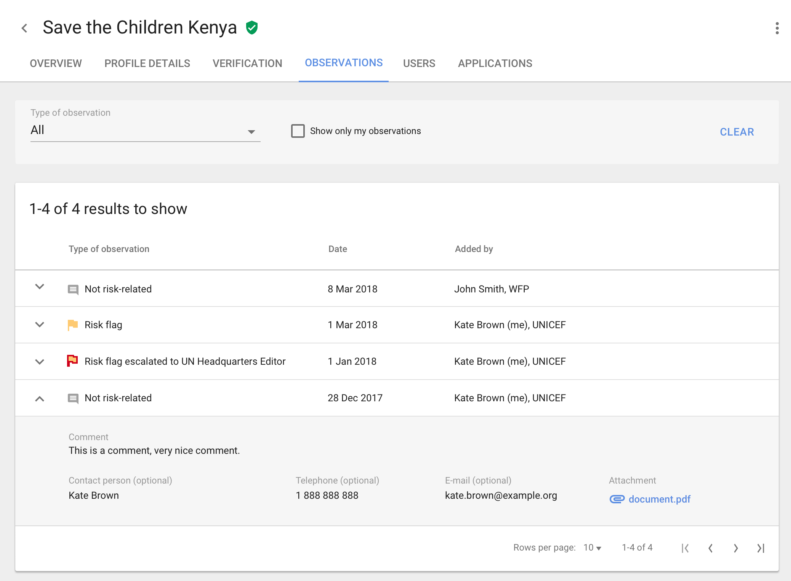

### Filters

User can filter data by:

* Type of observation
* Observations added by user. This checkbox helps to filter data to find observations that can be edited by the user.

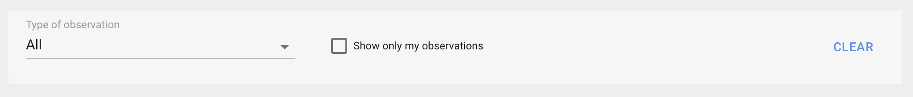

### Search Results

Table provides information about Type of observation, Date of observation and person, who added this observation. Rows of this table are expandable and show information about observation details, as shown on the screenshot below.

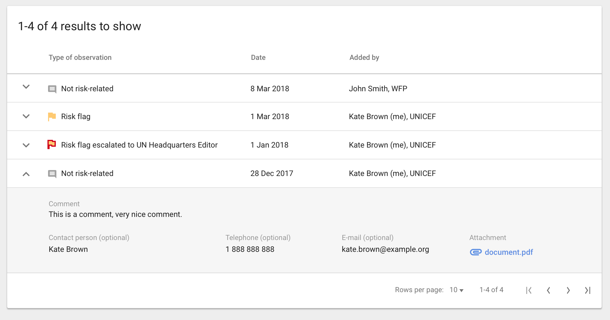

**Hover behavior:** when user, who is an owner of the observation, hovers on the row, the edit icon is shown. This user can edit his observation and change the status of added observation. The full flow for adding and editing observations is described [**here**](https://unicef.gitbook.io/unpp/agencies/flagging-a-partner).

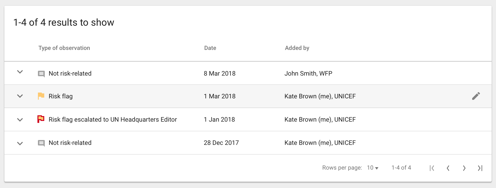

## Users

Screen contains a list of Partner's users as a read only. 

### Filters

tbd

### Results

Table provides basic information about users.

## Applications

The purpose of this screen is to show all CFEIs that Partner submitted his application for.

### Filters

User can filter data by:

* Search
* Country
* Sector & Area of Specialization
* Type of Application
* Agency
* checkbox to show only selected applications

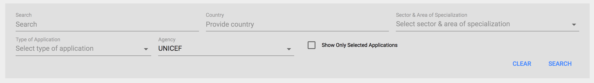

### Search Results

Table provides information about:

* Project Title \(which is also a link to CFEI overview page\)
* CN ID \(which is also a link to application details page\)
* Type of Application
* UN Agency
* Country
* Sector
* Submission/Received date
* Selected

