# Maintain Calls for Expression of Interest

## General Information

Once selecting an individual CFEI from the available lists, the user will be able to dive deeper into the informations for this particular project.

On the top section of the screen, the user will be presented with a few features to help them quickly identify the category, and status of the CFEI. Users with appropriate permissions have also access to additional actions:

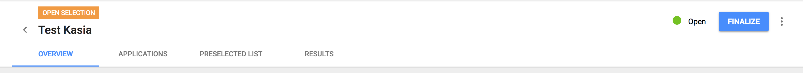

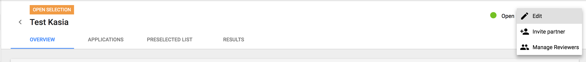

* **Edit**

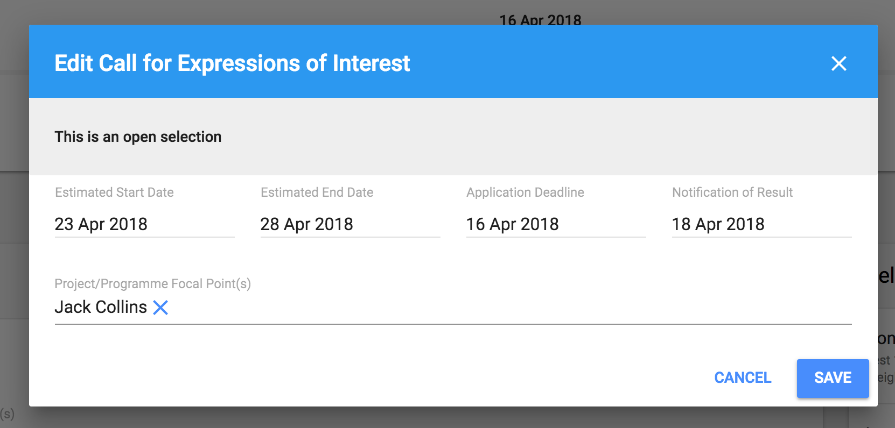

* **Invite Partners** - possible until Application deadline reached

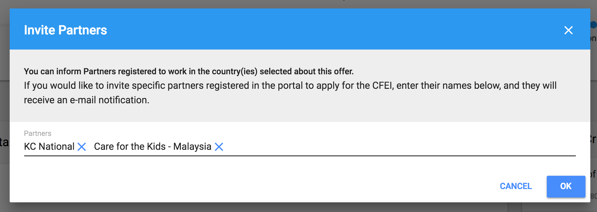

* **Manage Reviewers**

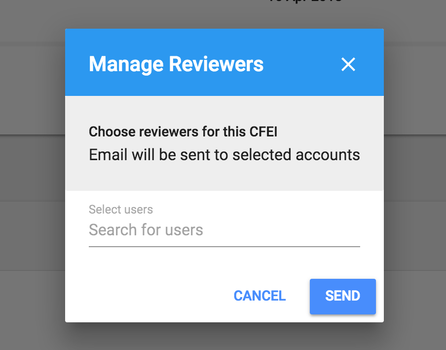

* **Finalize**

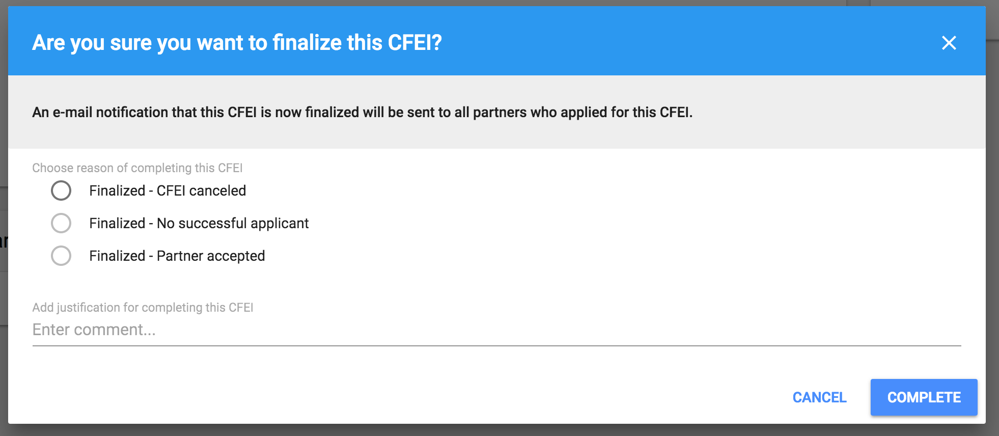

**Available statuses of a CFEI are:**

* Open \(Partners can submit their Concept Notes\);
* Closed/Under Review \(Application Deadline was reached, Partners can no longer submit Concept Notes, the assessment is in progress\);
* Completed \(CFEI was finalized\).

**Screen is divided by tabs:**

* Overview
* Applications
* Preselected List
* Results

## Overview

The CFEI Overview tab displays the following features to the User:

* Timeline - with following dates: Posted, Application Deadline, Notification Status, Estimated Start Date;
* Project Details - with information provided during creating a Call for Expression of Interest;
* Selection Criteria - with Weight of Criteria if provided;
* Invited Partner\(s\) - with name of Partner invited to participate in CFEI.

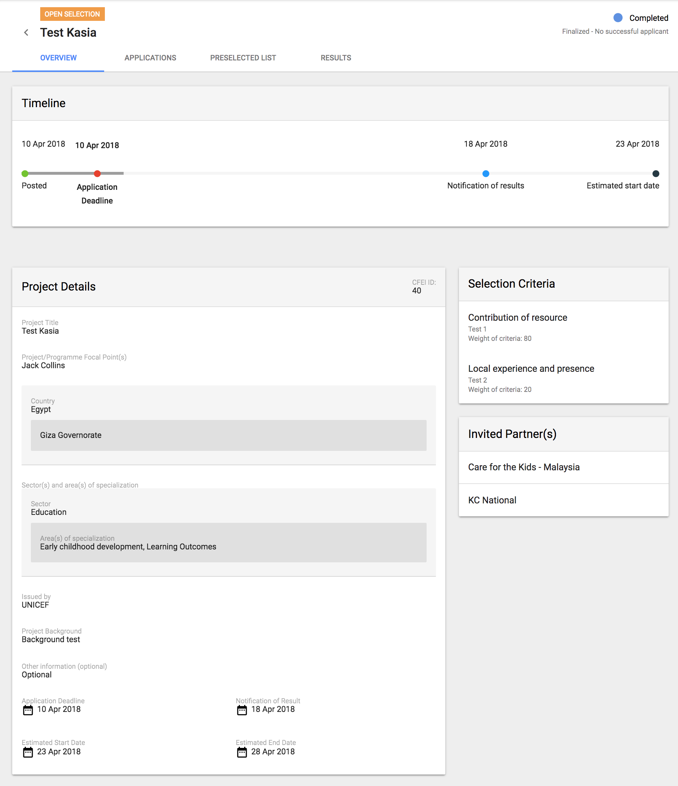

## Applications

The Second Tab on the list presents the user with an option to view a table list of all Partner Applications for a specific CFEI.

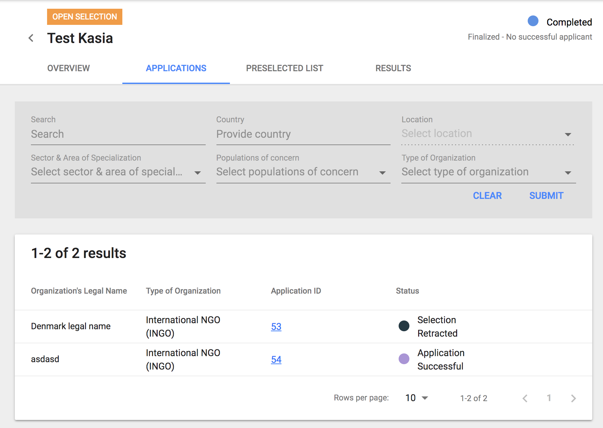

### Filters

User can narrow down search results by using following filters:

* Search
* Country
* Location \(filter active when Country is selected\)
* Sector & Area of Specialization
* Population of Concern
* Type of Organization

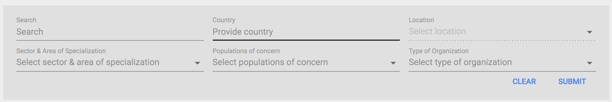

### Search results

Content displayed in the table contains the following information separated by columns:

* Organization's Legal Name
* Type of Organization
* Application ID - which is a link to Application details page
* Status

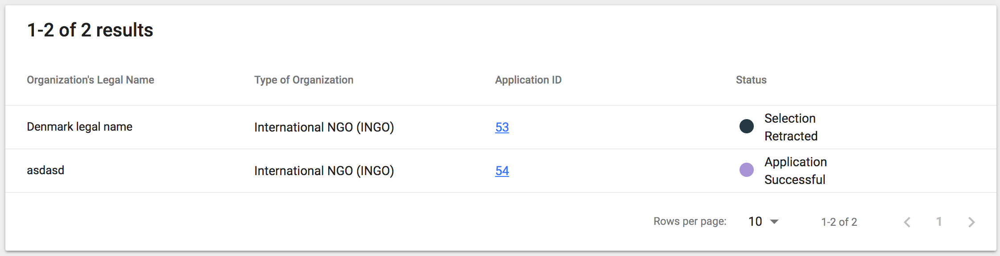

**Available** **Applications statuses are: **

* Pending
* Preselected
* Rejected
* Application under review
* Application Unsuccessful
* Application Successful
* Selection Accepted
* Selection Declined
* Selection Retracted

Until status of Call for Expression of Interest is Open, user, with appropriate permissions, can select some of the applications to preselected list.

## Preselected List

The third tab available is the "Preselected List". This is similar to the Applications list however, instead of displaying a list of Partners who have applied to the CFEI, it displays selected Partners, that were hand picked by Agency users to forego the Open Selection process. 

Depending on permissions, the content seen by a user in a table may vary. Columns: Review progress, Your score, Total score are displayed depending on given permissions as shown below:

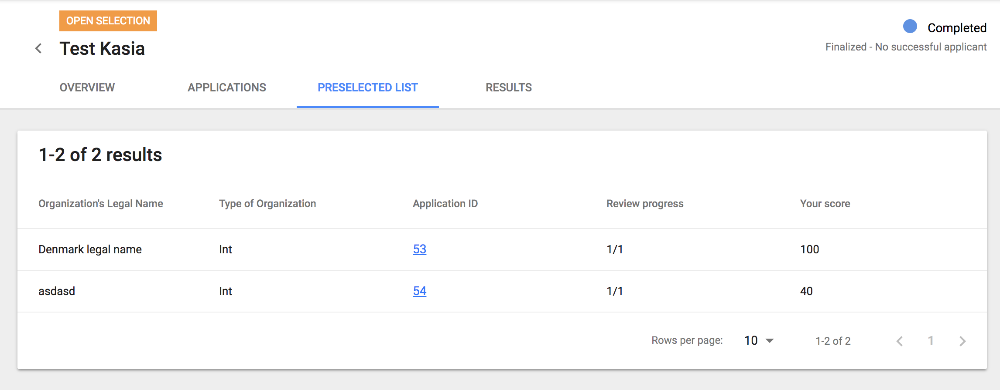

The Assessment of Applications is described [**here**](https://unicef.gitbook.io/unpp/agencies/applications-assessment)**.**

## Results

Lastly, a section remains available to the Agency User to view high level information regarding the results of the CFEI selection process. 

On this screen, depending on permissions, user has an ability to:

* add review summary
* retract a previous selection
* send reminder to a reviewer

The Agency User is able to see the following features and information for a specific CFEI:

* **Review Summary**: - Comment - Attachment - Ability to Add Summary if one is not already provided 
* **Selected Partner\(s\)**: - List of Partners selected for the project - each row with Organization's Legal Name is expandable, so user can view average score per criteria, notes added by reviewer, information when Partner was notified and when he accepted the offer, ability to download Concept Note;  - Ability to retract a previous selection 
* **Reviewers**: - List view of Agency Reviewers and a total count of assessments made per reviewer. Agency User has the ability to send reminders to the Reviewers 
* **Justification for completion**

