# User Interface

The overall user interface of UNPP for Agency consists of the following sections. Click on each tab below for more details:



On a Dashboard user has quick preview of actions taking place in the portal and has an access to important links.

For analysis purposes charts and numbers are provided on a separate cards for:

* Number of New Partners from past 15 days - displays number, chart and a link to Partners main screen;
* Number of Partners by type - displays donut chart with number inside it, below chart user can see a legend, where each Partner type is differentiated by color and a number for each type is added;
* Number of New Calls for Expression of Interest - displays number and link to all CFEIs;
* Number of Concept Notes to Score - displays a number

In the section below, user can view tables with more detailed information for:

* List of Concept Notes requiring your scoring, with information about: Project Title CFEI - showed as link to CFEI's Overview tab Number of Applications Notification of results deadline 
* List of Open CFEIs, with information about: Project Title CFEI - showed as link to CFEI's Overview tab Number of Applications Application deadline 
* Partner Decisions From 5 Past Days

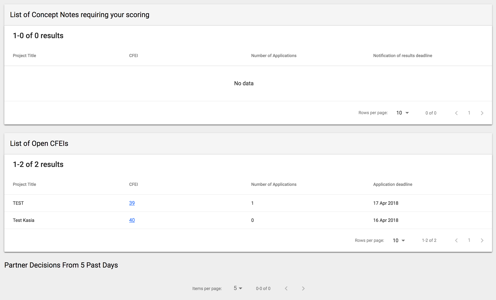



In this section user can add and view details of Expressions of Interests. Main screen is divided by three tabs, representing types of CFEIs:

* Calls for Expression of Interest
* Direct Selections
* Unsolicited Concept Notes

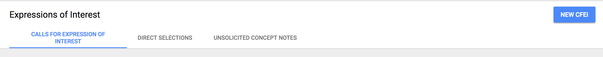

## Calls for Expression of Interest

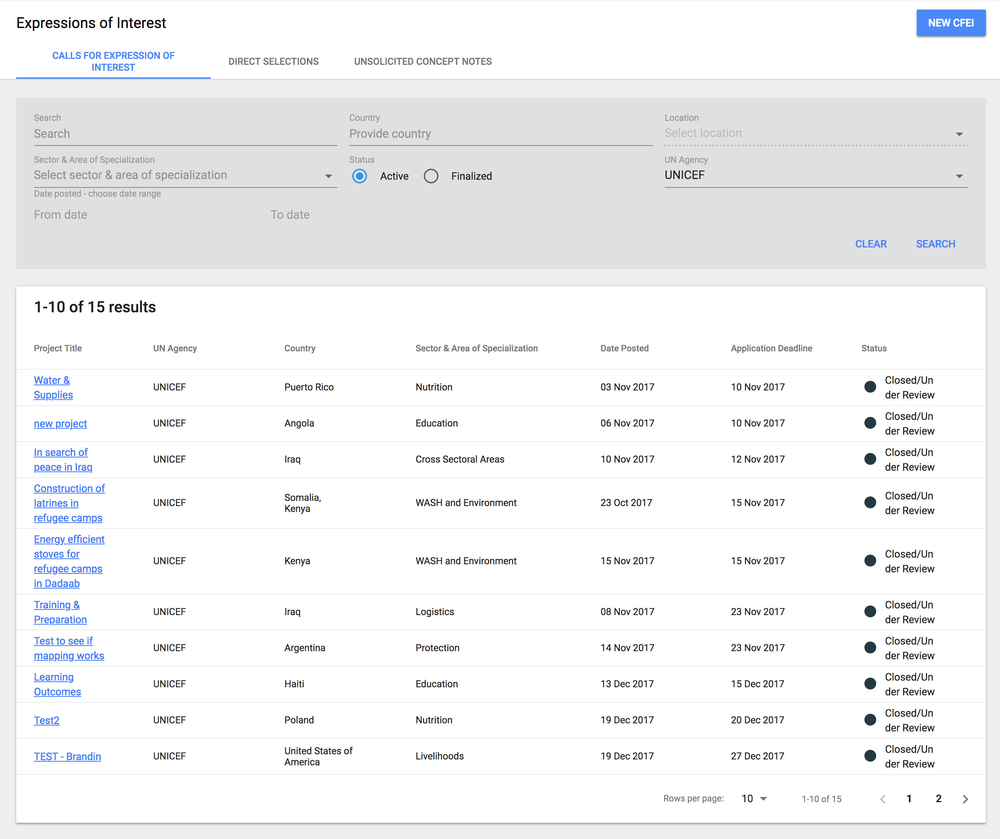

### Filters

User can filter the data by the following filters:

* Search
* Country
* Location \(field disabled until country is chosen\)
* Sector & Area of Specialization
* Status
* UN Agency
* Date posted - choose date range \(From date, To date\)

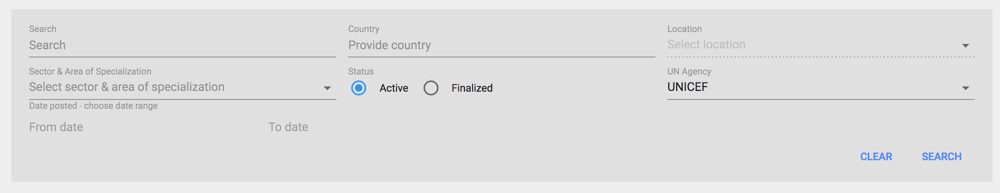

### Results

Table placed below filters, shows the list of search results. Each row represents Expression of Interest with basic information, placed in columns with following labels:

* Project Title
* UN Agency
* Country
* Sector & Area of Specialization
* Date Posted
* Application Deadline
* Status

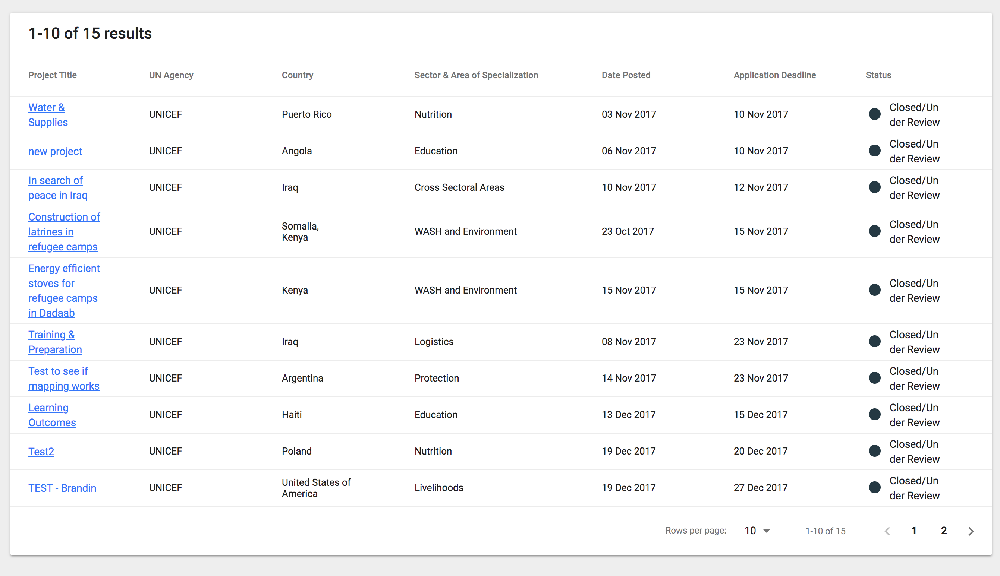

**Hover behavior   
**Column "Sector & Area of Specialization" shows only Sectors, because of lack of space. When hover on a cell with a title, the tooltip with full description of Areas of Specialization grouped by Sector will be displayed.

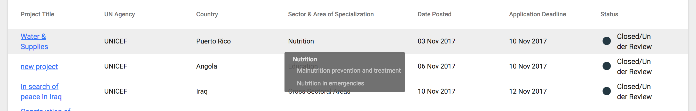

**Details of a single Call of Expression of Interest  
**To view details of a single Call of Expression of Interest, user needs to click on the Project Title. This action will take the user to a separate screen. Those screens are described here.

### New Call of Expression of Interest

To add new Call of Expression of Interest, user needs to click on "New CFEI" button, placed on the top right of a screen header, which displays a modal window. The flow of adding new Call of Expression of Interest is described here.

## Direct Selection

### Filters

User can filter the data by the following filters:

* Search
* Country
* Location
* Sector & Area of Specialization
* Status
* Agency
* Direct Selection Source

### Results

Table placed below filters, shows the list of search results. Each row represents Direct Selections with basic information, placed in columns with following labels:

* Project Title
* UN Agency
* Partner
* Country
* Sector & Area of Specialization
* Direct Selection Source
* Status

**Hover behavior **

Column "Partner" shows the name of the Partner. In case of too long name, when hover on the cell tooltip with full name is displayed.  
**  
**Column "Sector & Area of Specialization" shows only Sectors, because of lack of space. When hover on a cell with a title, the tooltip with full description of Areas of Specialization grouped by Sector will be displayed.

Column "Status" shows status of Direct Selection. When hover on this cell, tooltip with Partner status is displayed.

**Details of a single Direct Selection  
**To view details of a single Direct Selection, user needs to click on the Project Title. This action will take the user to a separate screen. Those screens are described here.

### New Direct Selection

To add new Direct Selection, user needs to click on "New Direct Selection" button, placed on the top right of a screen header, which displays a modal window. The flow of adding new Direct Selection is described here.

## Unsolicited Concept Note

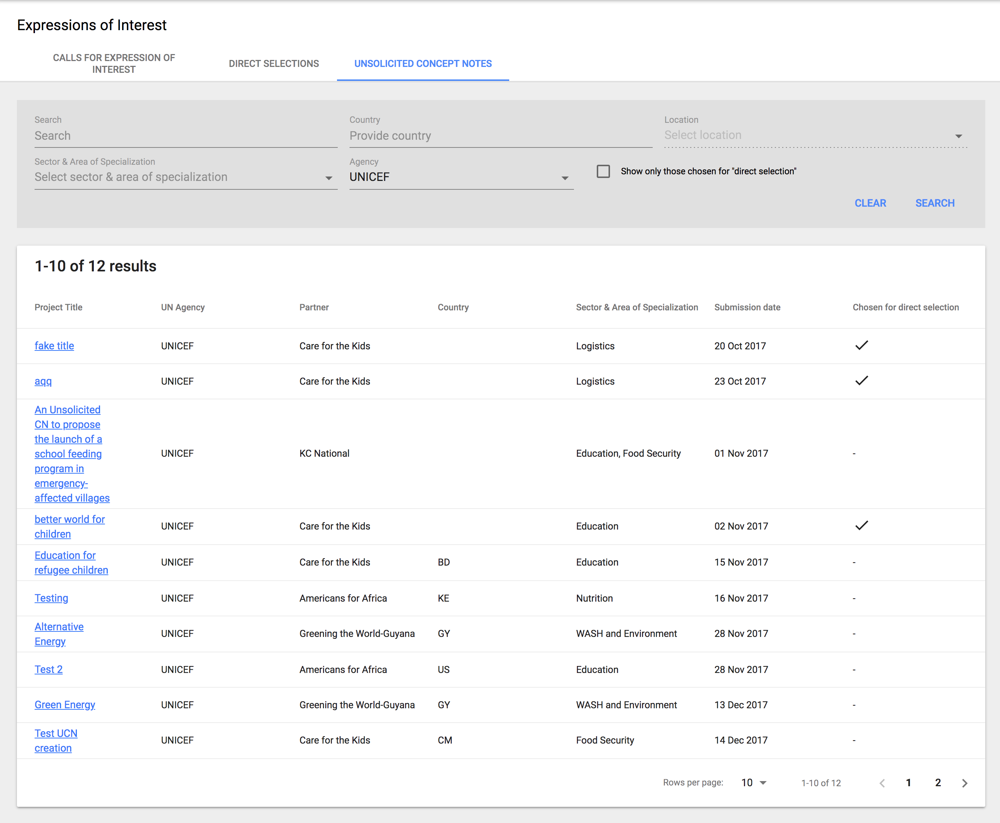

### Filters

User can filter the data by the following filters:

* Search
* Country
* Location
* Sector & Area of Specialization
* Agency
* checkbox for: Show only those chosen for "direct selection"

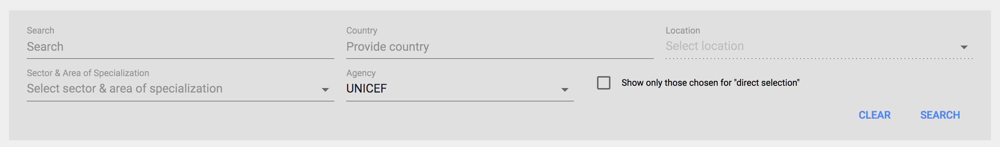

### Results

Table placed below filters, shows the list of search results. Each row represents Unsolicited Concept Notes with basic information, placed in columns with following labels:

* Project Title
* UN Agency
* Partner
* Country
* Sector & Area of Specialization
* Submission Date
* Chosen for direct selection

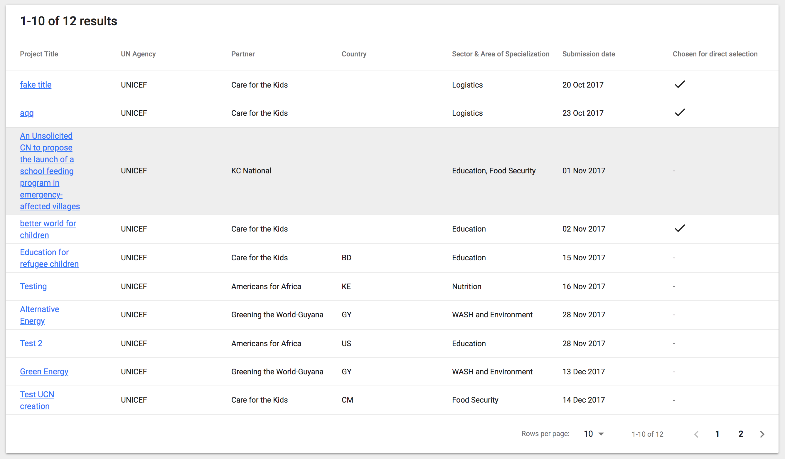

**Hover behavior   
**Column "Sector & Area of Specialization" shows only Sectors, because of lack of space. When hover on a cell with a title, the tooltip with full description of Areas of Specialization grouped by Sector will be displayed.

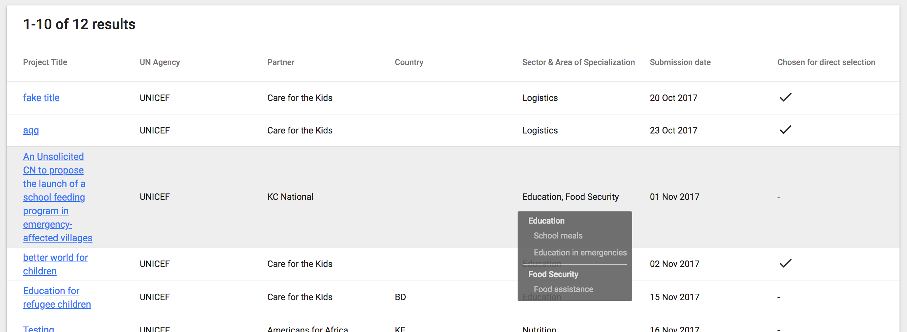



This screen provides information about Partners registered in the UNPP. Agency user can filter the data and view detailed information about a Partner.

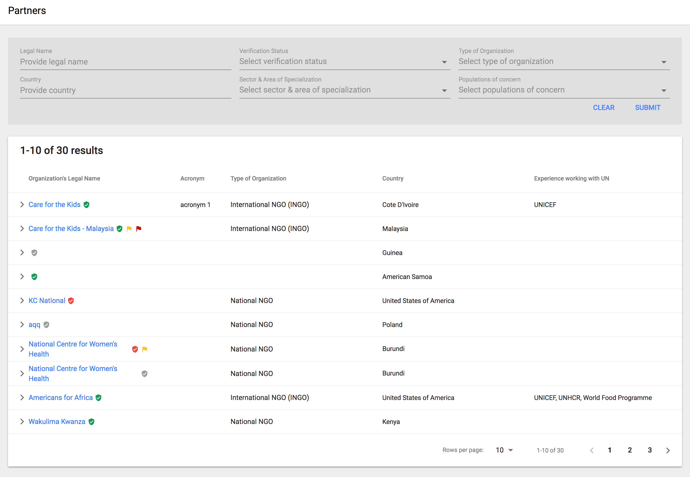

### Filters

To filter the data, user can use the following set of filters:

* Legal Name
* Verification Status
* Type of Organization
* Country
* Sector & Are of Specialization
* Population of Concern

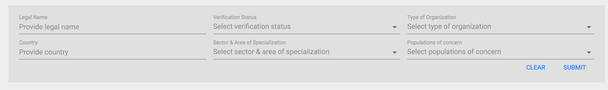

### Search Results

All search results are displayed in a form of a list. Table contains columns with following labels:

* Organization's Legal Name \(next to the the name of a Partner badges with verification status and types of flags are displayed\)
* Acronym
* Type of Organization
* Country
* Experience working with UN

Each row of a list is expandable to provide additional information about a Partner:

* Organization's mailing Address
* Organization's generic Phone number
* Website
* Name of Head
* Title of Head
* Email of Head
* Working languages
* Sector and areas of specialization

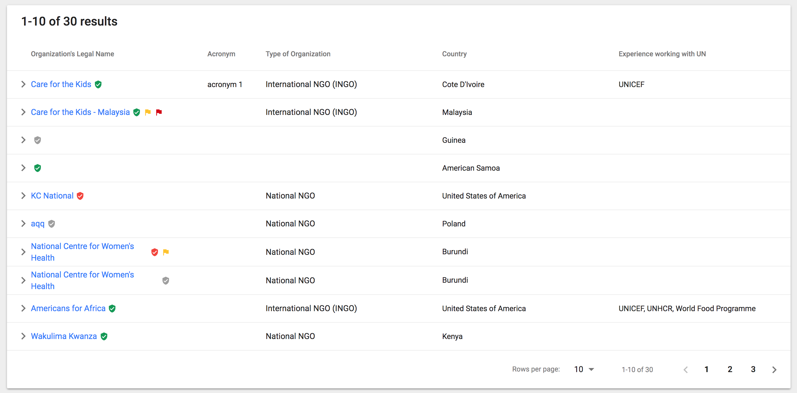

If provided information are not sufficient, user can access more detailed information by clicking Organization's Legal Name. User will be taken to separate set of screens then. Depending on the permission added to the user, the user will have an option to view information about Verification process, to read all observations added to the Profile \(not risk-related, risk related and escalated to the UN HQ Editor\) with option to run new verification process and add new observation. The user will be also able to view all profile details, Partner's users \(in read mode\) and applications submitted by this Partner. All screens and flows for theses processes are described [here](https://unicef.gitbook.io/unpp/agencies/untitled-2).



Reports section provides possibility to run reports based on set of filters. User can also see filtered data on the maps for better understanding Partners' presence and locations of the CFEIs. Reports can be exported as .csv. Reports section is divided by three tabs:

* Partner information
* CFEI Management
* Verification & Flagging

## Partner Information

On this screen user can run the report about Partner Profile and Partner's Contact Information.

### Filters

When users enters this screen is able to choose desired information thanks to provided filter options:

* Country
* Type of Organization
* Registered
* UN Experience
* Country Office
* Sector & Area of Specialization

When input fields are filled user can press Submit button to generate data in the form of a list and a map.

### Results

For quick access to export feature, export buttons are placed below the filters. If user wants to preview search results, map and a table are provided.

On the map user can see selected area and markers suggesting Partners' presence in this area.

Hover behavior: On hover over the marker, user can view Partners offices in this location.

Under the map a list of Parters is displayed. Table provides basic information about each Partner:

* Organization's Legal Name
* Number of Offices 
* Type of Organization
* Country
* Experience working with UN

Checking and unchecking the checkboxes placed in each row has an influence on data displayed on the map, as well on data to be exported.

## CFEI Management

On this screen user can run the report about CFEIs.

### Filters

When users enters this screen is able to choose desired information thanks to provided filter options:

* Country
* Project Location
* Type of Call
* Status
* Type of Organization
* Sector & Area of Specialization
* Posting Year

When input fields are filled user can press Submit button to generate data in the form of a list and a map.

### Results

For quick access to export feature, export button is placed below the filters. If user wants to preview search results, map and a table are provided.

Hover behavior: On hover over the marker, user can view CFEIs in this location.

Under the map a list of CFEIs is displayed. Table provides basic information about each CFEI:

* Project Name
* Agency
* Country
* Project Location

## Verification & Flagging

On this screen user can run the report about Verification & Flagging details.

### Filters

When users enters this screen is able to choose desired information thanks to provided filter options:

* Country
* Type of Organization
* Profile Type
* Verification Status
* Verification Status
* Verification Year
* Flagged

### Results

For quick access to export feature, export button is placed below the filters. If user wants to preview search results, a table is provided. Table provides basic information about each Partner:

* Organization's Legal Name \(with badges indicating a status of Verification and Flagging\)
* Acronym
* Type of Organization
* Country



User Management screens are accessible from a link placed in main left navigation panel.

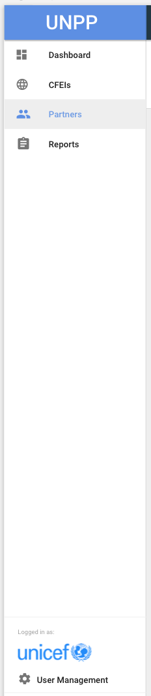



