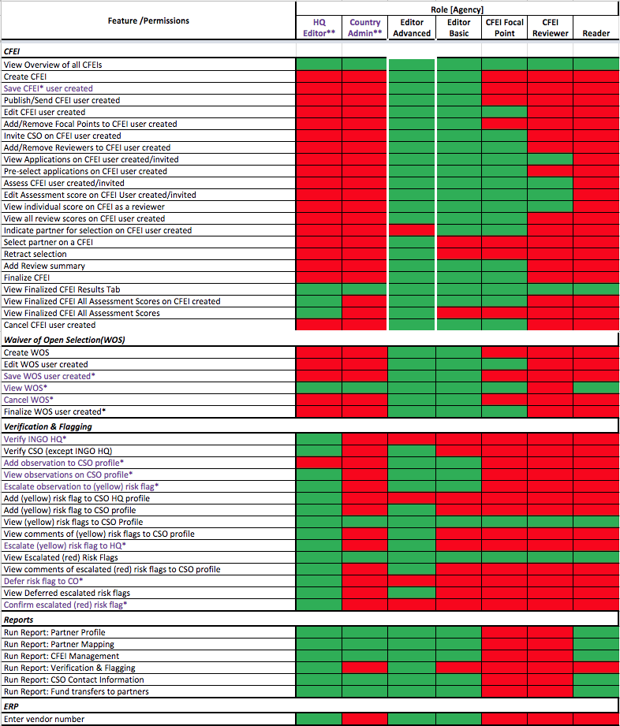

# User Management

## User Identity Management

Current Plans to enhance are in place to include the ability to manage Portal Users on the Frontend by building/adding a User Management System UI into the existing UNPP portal.

Current user management is restricted to Super Administrators with access to the Django Administrative Interface \(as represented in the diagram above\).

Future enhancements will elaborate on what is possible for High Level \(role\) Users to have control in regards to Roles & Permissions within both Agency and Partner Portals.

## Requirements

In UNPP, user management is an important feature required to add users, assign and reassign roles and location and deactivate user accounts. Both CSOs and agency users need to have this ability.

### Actions:

* The user who registers the CSO account on the portal and the head of organization are automatically given administrator roles on the portal.
* CSOs can add users to their organization and assign roles to the user.
* For INGOs, users can be reassigned
* CSOs can edit/change permissions for their users
* CSOs can deactivate users from their organization
* CSO users can view their user profiles, and set requests for notifications and the frequency of notifications
* CSOs have responsibility for managing users on their account
* Agencies can add users to their organization and assign roles to the user.
* Agencies users can be relocated/reassigned
* Agencies can edit/change permissions for their users
* All agency users will have automatic reader rights on the portal and their access will be authenticated via their agency-specific active directory.
* Agencies can deactivate users from their organization
* Each agency has responsibility for managing users on their account
* Agency superusers can deactivate a CSO organization and all its users

### Who has permissions for User Identity Management:

* Partner HQ administrator \(for entire organization\)
* Partner administrator \(for country location\)
* UN country administrator\*
* UN super administrator

### Preconditions for User management:

* CSO must be registered on the portal
* User must have a valid email addres**s**

### **Restrictions:**

* An administrator can only create a user for their own organization
* Partner HQ administrator can add user for all its country offices, but the country administrator can only add users for their country location
* Only INGO HQs and Agencies have permissions to re-assign users
* UN super administrator will deactivate any user accounts that appear on the UN Sanctions list

### Things to consider:

User roles in UNPP do not cleanly match to staff titles. Therefore, at least one staff in each country office will have to be assigned a country office administrator role, who will manually upgrade select users in the country office from the default ‘reader’ role.

## UNPP User Roles

> _Please see most recent _[_R&P Matrix_](https://docs.google.com/spreadsheets/d/1uvAPFPDQr2gW6-w0Tn5qUoR33z_U1M9bUFrm2W5FtVw/edit?usp=sharing) _for further understanding._

UNPP currently has 8 types of user roles implemented throughout two types of users:

* Partner Users
* Agency Users

> _NOTE: A change request is in place for including additional roles and more specific permissions._

### Partner User Roles

**Global Admin**

* Ability to edit profiles.
* Add/deactivate users. 
* Provision organization \(country\) profiles.
* Deactivate partner’s account.
* Edit, submit, and delete concept notes.

**Global Editor**

* Ability to view and edit profiles, and can edit and submit concept notes.

**Global Reader**

* Ability to view and edit profiles, and can edit and submit concept notes.

**Partner Admin**

* Ability to edit profiles, add/deactivate users, and edit, submit and delete concept notes. For national CSOs, the admin can also deactivate partner account.

**Partner Editor**

* Ability to view and edit profiles.
* Edit and submit concept notes.

**Partner Reader**

* Has the ability to view permissions at both HQ and Country levels.

### Agency User Roles

**Editor**

* An agency user with ability to add new CFEIs and Direct Selections, along with the ability to respond to an Unsolicited Concept Note for their agency and providing feedback  to a partner. An agency editor can also verify and flag a partner’s profile.This user also has  view rights on other agency’s CFEIs and awarded Concept Notes.
  * **CFEI Focal Point: **an Agency Editor with ability to manage all aspects of a CFEI’s assessment process, including the ability of entering a score on behalf of multiple reviewers. A creator of a CFEI and anyone indicated as a focal point in the CFEI form has this privilege.
  * **CFEI Reviewer: **an Agency user  selected to review and score preselected concept notes in a CFEI. This user is restricted from viewing other reviewers’ scores. This permission is only limited to the CFEIs assigned to the user.

**Reader**

* An agency user with view only rights across UNPP.

## Resources

User Roles & Permissions Matrix

[https://mail.google.com/mail/ca/u/0/\#search/nadine?projector=1&messagePartId=0.1](https://mail.google.com/mail/ca/u/0/#search/nadine?projector=1&messagePartId=0.1)

### R&P Matrix

|  |  |
| --- | --- |
|  |  |

### Matrix Notes

1. Each role has default permissions. For example, an editor basic can perform 20/23 actions for a CFEI.
2. Administrator can take away permissions within a default role. For example, make editor basic now only able to perform 15/23 actions for a CFEI
3. Administrator cannot add more permissions than is in a default role. So editor basic cannot have 24 actions
4. If a user needs additional actions, then they can be given higher role. E.g. give editor advanced role instead, and remove permissions from the default.

