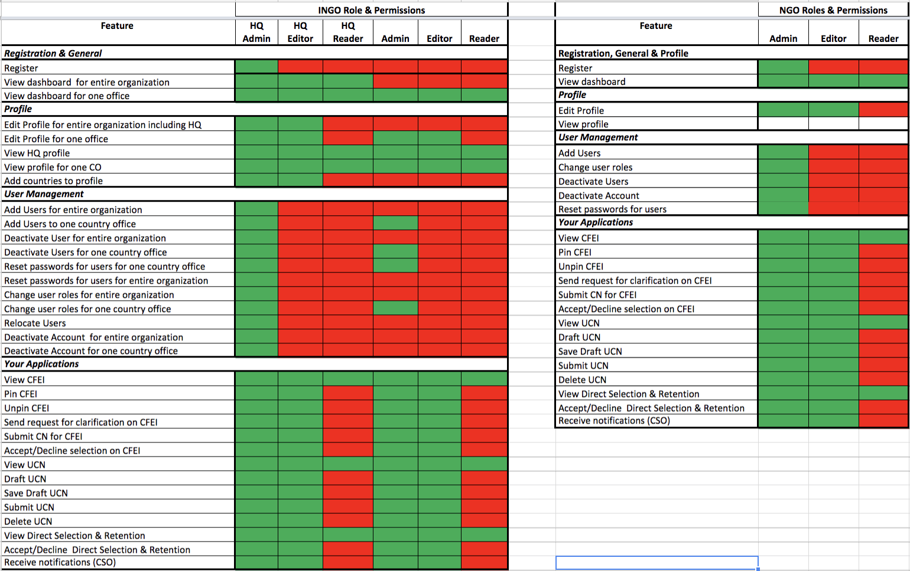

# User Management

## User Identity Management

### Overview

Current Plans to enhance are in place to include the ability to manage Portal Users on the Frontend by developing a User Management System for the  UNPP portal.

Current user management is restricted to Super Administrators with access to the Django Administrative Interface \(as represented in the diagram above\).

Below, we elaborate on the enhancements for what will be possible for Portal Users to have control in regards to Roles & Permissions within both Agency and Partner Portals.

## Features

In UNPP, user management is an important feature required to add users, assign and reassign roles and location and deactivate user accounts. Both **Partners** and **Agency** users need to have this ability.

### Partner User Management:

#### Overview:

The user management feature gives CSOs the ability to provision portal access to users from their organization. In addition, CSOs can assign roles and permissions, reassign users from one location to another as well as deactivate users from their organization’s account.

#### Assumptions & Dependencies:

* The CSO has been granted access to the portal.
* The head of organization and person who registers the organization \(if different from the head of organization\) have administrator role and permissions for the account registered.

The user who registers the CSO account on the portal and the head of organization are automatically given administrator roles on the portal.

**Key Functionality & Controls**

| Ability to add users to their organization |
| --- | --- | --- | --- | --- | --- | --- | --- | --- |
| Ability to assign roles and permissions to users in the organization |
| Ability to deactivate users from the organization |
| Ability to change user’s roles and permissions |
| Ability to reassign users to a different location. |
| Ability to restrict user management access to CSO administrator |
| Ability to restrict a user to only adding users to their own organization |
| Ability to restrict reassigning users to a different location to INGOs |
| Ability to scan organization’s users against the UN Security Council’s Sanctions List |

### Agency User Management:

#### Overview:

The user management feature allows for participating agency users to be assigned roles and permissions on the portal. It also allows for participating agencies to reassign users’ roles and location as well as deactivate user accounts. The user profile feature allows an agency user to view information on their user profile and edit some information on their profile.

#### Assumptions & Dependencies:

Participating agency users have access to the portal

**Key Functionality & Controls: **

| Ability for Ability for all participating agency users to have reader permissions as a default. |
| --- | --- | --- | --- | --- | --- | --- | --- | --- | --- | --- | --- | --- |
| Ability for participating agencies to assign additional roles & permissions to the agency’s users. |
| Ability for participating agencies to assign users to multiple countries \(locations\) with the same or different roles & permissions in each country location. |
| Ability for participating agencies to modify permissions within a role. |
| Ability for participating agencies to reassign agency users to different country locations. |
| Ability for participating agencies to deactivate user accounts. |
| Ability for super administrators to add, assign roles & permissions, relocate users and deactivate users from a CSO account. |
|  Ability for participating agencies users to view their user profile and perform the following actions:    • View their permissions setting  • Edit their contact details \(except for email\)  • Manage their notification frequency on CFEI updates |
| Ability to restrict assignment of roles and permissions to users with administrator or HQ editor permissions. |
| Ability to restrict user management of CSOs to users with super administrator permissions. |
| Ability to restrict country administrators and HQ editors to managing users for their specific agency. |
| Ability to restrict modification of permissions to within a role group, and permissions groupings. |
| Ability to restrict altering permission settings to administrator or super user. |

### Who has permissions for User Identity Management:

* Partner HQ administrator \(for entire organization\)
* Partner administrator \(for country location\)
* UN country administrator\*
* UN super administrator

## UNPP User Roles

> _Please see most recent _[_R&P Matrix_](https://docs.google.com/spreadsheets/d/1h_C5XuKgNoV7QoiW1TqOjeLeXaTyfu4j12tTLRtKVIw/edit?usp=sharing) _for further understanding._

UNPP has introduced the following roles implemented in UNPP which are separated mainly by two types of users:

* Partner Users
* Agency Users

### Partner User Roles

**HQ Administrator**

Partner HQ Administrator is a CSO user with ability to perform the following features:

* Register a CSO account.
* Create and edit profiles.
* Add/deactivate users.
* Provision country profiles.
* Deactivate CSO’s account.
* Submit and delete concept notes.
* Accept or decline partnership offers from the UN. 
* The Partner HQ Administrator has the same permissions at both HQ and Country levels. 
* The Partner HQ Administrator is only applicable to those CSOs that are international NGOs.

**HQ Editor**

Partner HQ Editor is a CSO user with the ability to perform the following features:

* Edit their organization’s profiles.
* Submit and delete concept notes.
* Accept or decline partnership offers from the UN. 
* This user has the same permission at both HQ and Country levels. 
* The Partner HQ Editor is only applicable to those CSOs that are international NGOs.

**HQ Reader**

Partner Reader is a CSO user with view permissions at the country profile level. If a member of an INGO, this user also has view permissions of the HQ profile.

**Country Admin**

Partner Country Administrator is a CSO user with specific permissions for a country profile of an organization.

This user can perform the following actions:

* Ability to view permissions of the HQ profile if a member of an international NGO. 
* View and edit profiles.
* add/deactivate users. 
* submit and delete concept notes. 
* accept or decline partnership offers from the UN. 
* For national CSOs, this role can also deactivate partner account.

**Country Editor**

Partner Country Editor is a CSO user with specific permissions for a country profile of an organization, and view permissions of the HQ profile if a member of an international NGO. 

This user can perform the following actions: 

* Edit profiles
* Submit and delete concept notes.
* Accept or decline partnership offers from the UN.

**Country Reader**

Partner Reader is a CSO user with view permissions at the country profile level.

### Agency User Roles

**Super Administrator**

Super Administrator is an agency user with full administrative permissions throughout UNPP.

**HQ Editor**

HQ Editor is an agency user with permissions to verify profiles of all CSOs on the portal, including the HQ profiles of INGOs. 

The HQ editor can review observations that have been marked with a risk flag and escalated, and either mark these with a red risk flag or defer them back to country offices. 

Additionally, this user can assign roles and permissions to users in their organization and manage the content on the knowledge library.

**Administrator**

Administrator is an agency user with permissions to assign roles and permissions to their agency users on the portal.

**Advanced Editor**

Advanced Editor is an agency user with ability to create CFEIs and DSRs including from Unsolicited Concept Notes for their agency. 

This user can select a CSO for a partnership opportunity. An advanced editor can also verify and add observations to a CSO’s profile. 

An advanced editor may be assigned by the CFEI focal point to be a member of the CFEI review team.

**Basic Editor**

Basic Editor is an agency user with ability to create CFEIs and DSRs including from Unsolicited Concept Notes for their agency. 

A basic editor may be assigned by the CFEI focal point to be a member of the CFEI review team

**CFEI Focal Point**

CFEI Focal Point is an **advanced** or **basic** **editor** with ability to manage the assessment process of a specific CFEI, including the ability to:

* Pre-select concept notes
* Nominate the members of the review team
* View all review scores. 

A creator of a CFEI and anyone indicated as a focal point in the CFEI form has this privilege. 

If the CFEI Focal point is an advanced editor, then the user can issue a partnership offer to a CSO.

**CFEI Reviewer**

CFEI Reviewer is an Agency user assigned by the **CFEI focal point** to review and score preselected concept notes in a CFEI. 

This user is restricted from viewing other reviewers’ scores during the time that the assessment of concept notes is in progress. 

This permission is only limited to the CFEIs assigned to the user.

**Reader**

Reader is an agency user with view only permissions on UNPP. This user also has view rights on other agency’s CFEIs and awarded Concept Notes.

## Resources

User Roles & Permissions Matrix

https://docs.google.com/spreadsheets/d/1CPf_hWeTwPXrVPd-suggavA7GFoLdJGxx1oROz2unnY/edit?usp=sharing

### R&P Matrix

