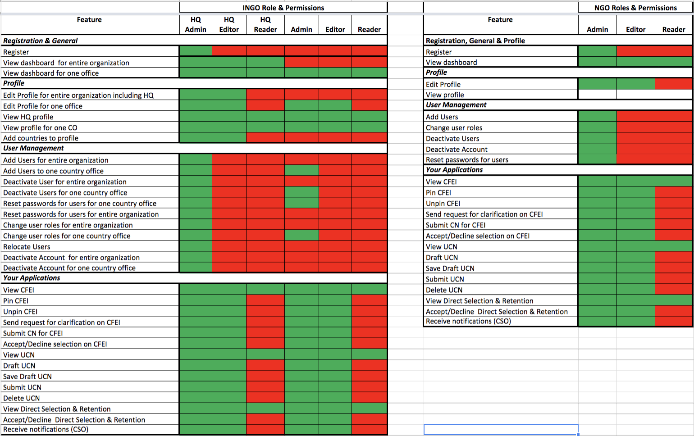

# User Management

## User Identity Management

Current Plans to enhance are in place to include the ability to manage Portal Users on the Frontend by building/adding a User Management System UI into the existing UNPP portal.

Current user management is restricted to Super Administrators with access to the Django Administrative Interface \(as represented in the diagram above\).

Below, we elaborate on the enhancements for what will be possible for Portal Users to have control in regards to Roles & Permissions within both Agency and Partner Portals.

## Requirements

In UNPP, user management is an important feature required to add users, assign and reassign roles and location and deactivate user accounts. Both CSOs and agency users need to have this ability.

### CSO User Management:

#### Overview:

The user management feature gives CSOs the ability to provision portal access to users from their organization. In addition, CSOs can assign roles and permissions, reassign users from one location to another as well as deactivate users from their organization’s account.

#### Assumptions & Dependencies:

* The CSO has been granted access to the portal.
* The head of organization and person who registers the organization \(if different from the head of organization\) have administrator role and permissions for the account registered.

The user who registers the CSO account on the portal and the head of organization are automatically given administrator roles on the portal.

**Key Functionality & Controls**

| Ability to add users to their organization |
| --- | --- | --- | --- | --- | --- | --- | --- | --- |
| Ability to assign roles and permissions to users in the organization |
| Ability to deactivate users from the organization |
| Ability to change user’s roles and permissions |
| Ability to reassign users to a different location. |
| Ability to restrict user management access to CSO administrator |
| Ability to restrict a user to only adding users to their own organization |
| Ability to restrict reassigning users to a different location to INGOs |
| Ability to scan organization’s users against the UN Security Council’s Sanctions List |

### Agency User Management:

#### Overview:

The user management feature allows for participating agency users to be assigned roles and permissions on the portal. It also allows for participating agencies to reassign users’ roles and location as well as deactivate user accounts. The user profile feature allows an agency user to view information on their user profile and edit some information on their profile.

#### Assumptions & Dependencies:

Participating agency users have access to the portal

**Key Functionality & Controls: **

| Ability for Ability for all participating agency users to have reader permissions as a default. |
| --- | --- | --- | --- | --- | --- | --- | --- | --- | --- | --- | --- | --- |
| Ability for participating agencies to assign additional roles & permissions to the agency’s users. |
| Ability for participating agencies to assign users to multiple countries \(locations\) with the same or different roles & permissions in each country location. |
| Ability for participating agencies to modify permissions within a role. |
| Ability for participating agencies to reassign agency users to different country locations. |
| Ability for participating agencies to deactivate user accounts. |
| Ability for super administrators to add, assign roles & permissions, relocate users and deactivate users from a CSO account. |
|  Ability for participating agencies users to view their user profile and perform the following actions:    • View their permissions setting  • Edit their contact details \(except for email\)  • Manage their notification frequency on CFEI updates |
| Ability to restrict assignment of roles and permissions to users with administrator or HQ editor permissions. |
| Ability to restrict user management of CSOs to users with super administrator permissions. |
| Ability to restrict country administrators and HQ editors to managing users for their specific agency. |
| Ability to restrict modification of permissions to within a role group, and permissions groupings. |
| Ability to restrict altering permission settings to administrator or super user. |

### Who has permissions for User Identity Management:

* Partner HQ administrator \(for entire organization\)
* Partner administrator \(for country location\)
* UN country administrator\*
* UN super administrator

## UNPP User Roles

> _Please see most recent _[_R&P Matrix_](https://docs.google.com/spreadsheets/d/1uvAPFPDQr2gW6-w0Tn5qUoR33z_U1M9bUFrm2W5FtVw/edit?usp=sharing) _for further understanding._

UNPP currently has 8 types of user roles implemented throughout two types of users:

* Partner Users
* Agency Users

> _NOTE: A change request is in place for including additional roles and more specific permissions._

### Partner User Roles

**Global Admin**

* Ability to edit profiles.
* Add/deactivate users. 
* Provision organization \(country\) profiles.
* Deactivate partner’s account.
* Edit, submit, and delete concept notes.

**Global Editor**

* Ability to view and edit profiles, and can edit and submit concept notes.

**Global Reader**

* Ability to view and edit profiles, and can edit and submit concept notes.

**Partner Admin**

* Ability to edit profiles, add/deactivate users, and edit, submit and delete concept notes. For national CSOs, the admin can also deactivate partner account.

**Partner Editor**

* Ability to view and edit profiles.
* Edit and submit concept notes.

**Partner Reader**

* Has the ability to view permissions at both HQ and Country levels.

### Agency User Roles

**Editor**

* An agency user with ability to add new CFEIs and Direct Selections, along with the ability to respond to an Unsolicited Concept Note for their agency and providing feedback  to a partner. An agency editor can also verify and flag a partner’s profile.This user also has  view rights on other agency’s CFEIs and awarded Concept Notes.
  * **CFEI Focal Point: **an Agency Editor with ability to manage all aspects of a CFEI’s assessment process, including the ability of entering a score on behalf of multiple reviewers. A creator of a CFEI and anyone indicated as a focal point in the CFEI form has this privilege.
  * **CFEI Reviewer: **an Agency user  selected to review and score preselected concept notes in a CFEI. This user is restricted from viewing other reviewers’ scores. This permission is only limited to the CFEIs assigned to the user.

**Reader**

* An agency user with view only rights across UNPP.

## Resources

User Roles & Permissions Matrix

[https://mail.google.com/mail/ca/u/0/\#search/nadine?projector=1&messagePartId=0.1](https://mail.google.com/mail/ca/u/0/#search/nadine?projector=1&messagePartId=0.1)

### R&P Matrix

|  |  |
| --- | --- |
|  |  |

### Matrix Notes

1. Each role has default permissions. For example, an editor basic can perform 20/23 actions for a CFEI.
2. Administrator can take away permissions within a default role. For example, make editor basic now only able to perform 15/23 actions for a CFEI
3. Administrator cannot add more permissions than is in a default role. So editor basic cannot have 24 actions
4. If a user needs additional actions, then they can be given higher role. E.g. give editor advanced role instead, and remove permissions from the default.

