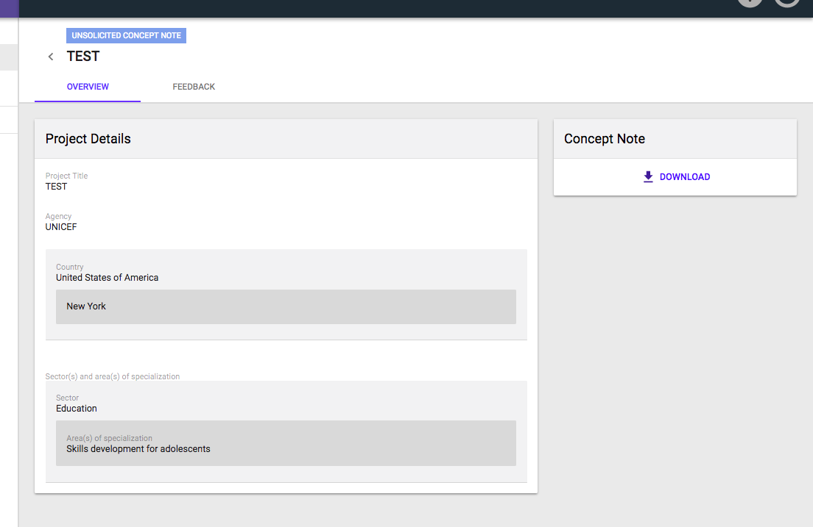
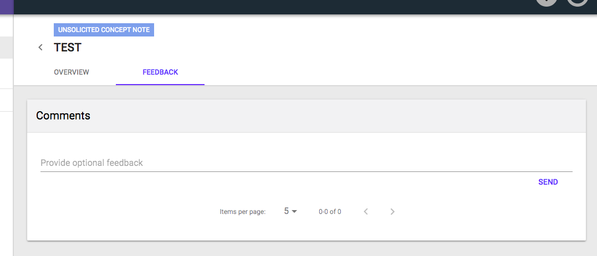

# Adding new Unsolicited Concept Note

## Overview

If a user wishes to apply directly to a CFEI that they've found available on the portal, they are able to create and save an Unsolicited Concept Note \(UCN\) for their profile.

## Your Applications

To begin, select the "Your Applications" tab on the Navigation drawer to the left of the UI.

This page presents to the user a filterable table displaying all applications they have submitted. 

### Tabs

At the very top of the page, there are three tabs titled:

* Calls for Expression of Interest \(CFEI\)
* Unsolicited Concept Notes \(UNC\)
* Direct Selection

### Calls for Expression of Interest \(CFEI\)

This page is the first tab section presented \(as default\) when accessing the "Your Applications" page.

Displayed in a filterable table is a list of all of your applications with the following information for each line item \(separated into columns\).

* ID
* Project Title
* CFEI ID
* UN Agency
* Country
* Sector
* Application Date
* Status

### Unsolicited Concept Notes \(UCN\)

Displayed in a filterable table is a list of all of your UCN applications with the following information for each line item \(separated into columns\).

* Application ID
* Project Title
* UN Agency
* Country
* Sector
* Submission Date
* Chosen for Direct Selection

### Direct Selections

Displayed in a filterable table is a list of all of your Direct Selections applications with the following information for each line item \(separated into columns\).

* Application ID
* Project Title
* UN Agency
* Country
* Sector
* Submission Date
* Direct Selection Source
* Status

## Create New UCN

In order to create a new Unsolicited Concept Note, first navigate to the **Unsolicited Concept Note** Tab in the **Your Applications** section.

On the top right corner of the page, click the button title "**New Unsolicited Concept Note"**.

A modal will display where the User will need to complete the following form fields:

* Select an **Agency**
* Project **Title**
* Project **Location**
  * Region of Location
* Select a **Sector**
  * **Areas of Specialization**
* Upload **Concept Note**
* **Confirm** their Profile is up to date.
* Click **"OK"**

Once the UCN is successfully created, the user will be taken directly to the **Overview** page of their recently created UCN where they will be able to view the UCN Details.

## UCN Details

To see the particular details and Feedback regarding the concept note, simply click on one of the UCN applications from the table list.

The Overview tab will be the default page for the user to quickly view all the details around this specific application.

Furthermore, the user will have the option to download the attached Concept Note by clicking the "**Download"** button on the top right card. 

  

### Feedback

Lastly, the option to provide feedback regarding this UCN is available through the **Feedback** tab on a selected UCN.

The only options on this page is a text form where the user may enter his comments.

To complete their submission, the user must click the **Send** button.

