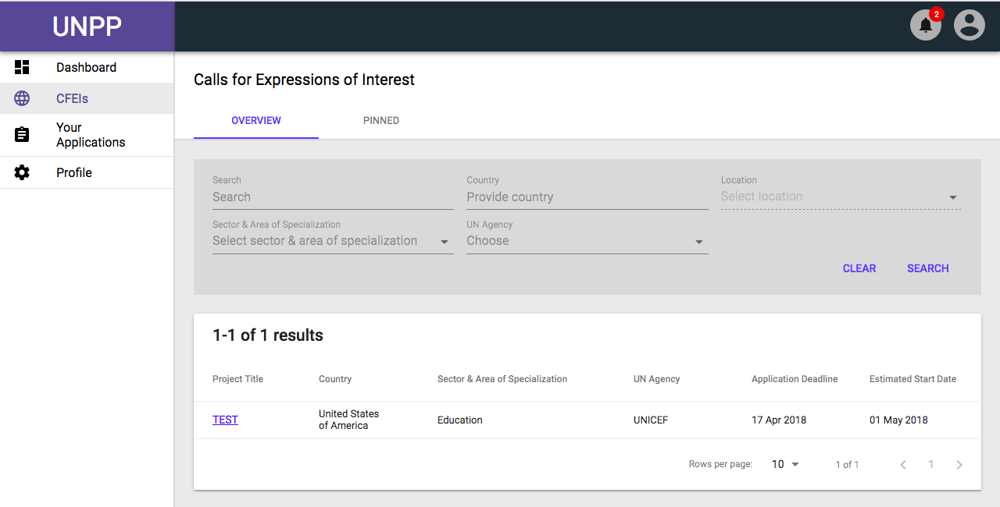
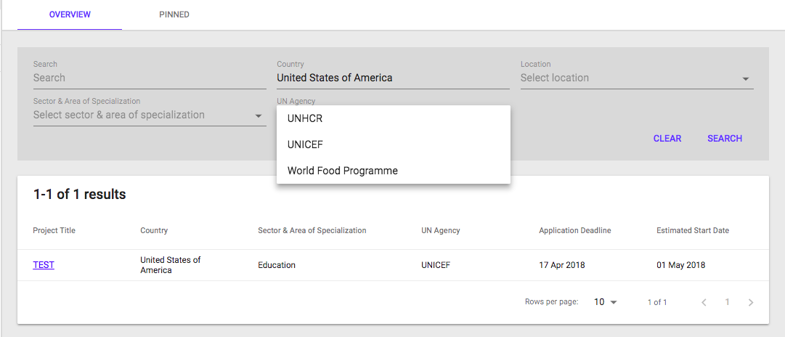
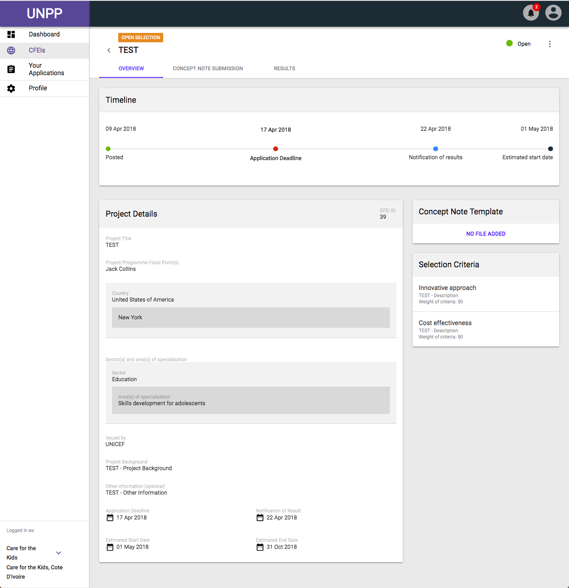
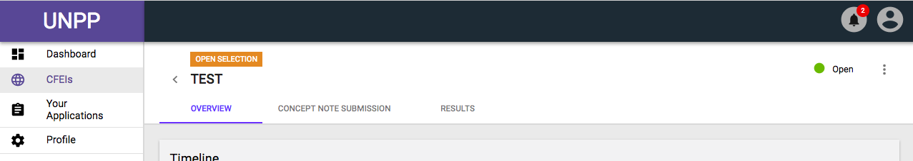
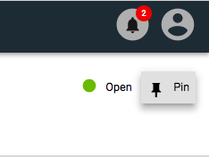
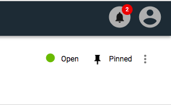
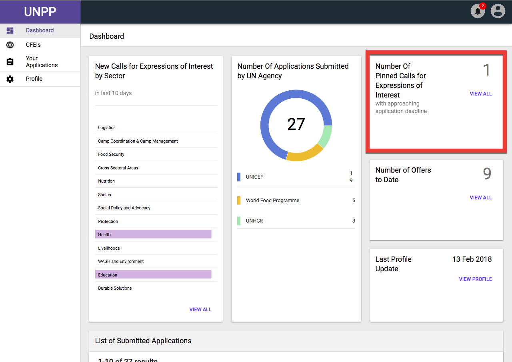

# Searching and pinning CFEIs

## Filtering

### Navigation

Partners have the ability to search specific criteria for CFEIs they would like to apply to. Furthermore, Partners are able to pin selected CFEIs of interest. 

### Filter Options

* **Search**
  * The first filter option allowing the user to openly search through multiple criteria via matching text characters. The most versatile way to find CFEIs with specific information.
* **Country**
  * Allows the Partner user to search all CFEIs in a given Country.
  * **Location**
    * Further allows the user to select specific regions within a given country that are available.
* **Sector & Area of Specialization**
  * Allows the Partner User to search all CFEIs in a given Sector or Specialization.
* **UN Agency**
  * Allows the Partner User to search all CFEIs created by a specific UN agency. 
* **Clear**
  * Clears the form fields and reloads the page to display all CFEIs.
* **Search**
  * Clicking this button confirms the criteria in which the table information should display. Must be clicked in order to return a result. 

## Pinning

### CFEI Page

After finding the ideal CFEIs available from the search criteria the user has entered, they will then be able to click on the line item and see the CFEI's details. 

On the top right corner of the selected CFEI Details page, the UI displays a menu option identified with three dots vertically aligned.

Upon clicking the menu, the option to Pin will display and the user can then complete the action of pinning this specific CFEI to their Dashboard for quick access the next time they return to the Dashboard.

### Dashboard

When the user returns to their Dashboard, they will be able to see high-level information regarding how many CFEIs they have pinned, represented by a a large number.

Furthermore, an option allowing the user to view all the pinned CFEIs is available in the same card, named "View All".

