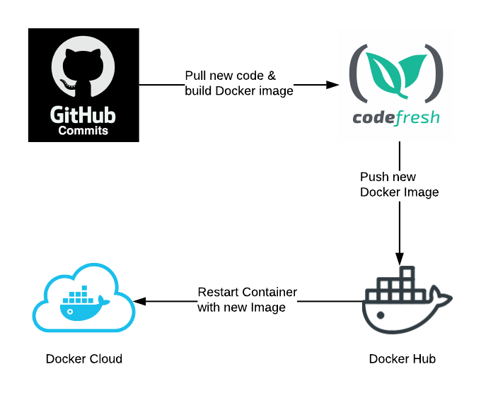

# Deployment / DevOps

Main development branch is `develop`, from it we branch for features / bugfixes and then open Pull Requests \(PRs\) to do code review and verification. 

`Develop` and `master` branches are setup to automatically build and deploy on changes using the following tooling / flow:

Typically `master` branch would deploy to a **production** environment while `develop` is pushed to a **QA / Staging**.

