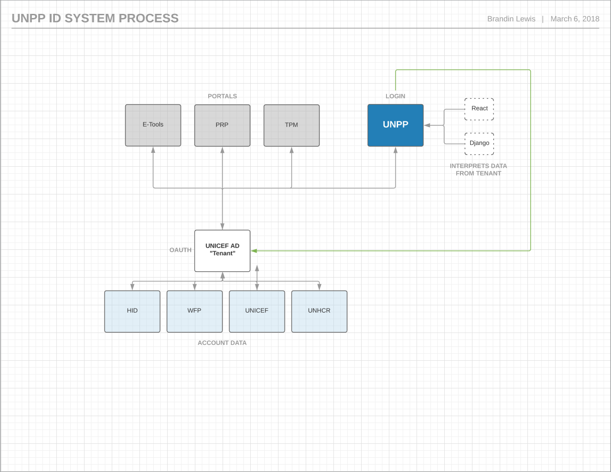

# ID System Process

## Features

Unicef currently calls upon a "Tenant" \(Microsoft Azure AD\) OAuth for accessing current portal products.

> OAuth is an open standard for access delegation commonly used as a way for Internet users to grant websites or applications access to their information on other websites but without giving them the passwords.

## Process

UNICEF Agencies User Account data is currently stored in a unified storage "Tenant" named UNICEF AD

UNICEF AD Currently pulls information from the following Agencies:

* HID
* WFP
* UNICEF
* UNHCR

OAuth is called upon form the Tenant when attempting to access the following UN Portal Tools:

* E-Tools
  * PMP
  * Etc.
* PRP
* TPM
* **UNPP**

### ID System Process Diagram

