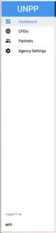
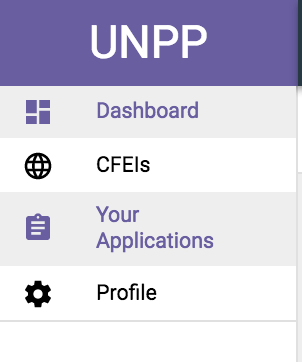

# Navigation

## Left Navigation Drawer:

The left side of the Portal UI is a dedicated navigation panel broken into the most basic and fundamental sections a user can access valuable information.

Below is a list of links that can be found in the Left Navigation Drawer:

### Agency Nav Drawer

The Agency Navigation Drawer overall shares the same UI throughout each Agency User Type, with the acceptation of a few features for Admin Roles. We will break down the flows in the following section.

**High-Level Navigation**

* **Dashboard**
* **CFEIs**
* **Partners**
* **Agency Settings**
* **Agency User \(Quick Switch\) Toggle**

### Partner Nav Drawer

The Partner Navigation Drawer overall shares the same UI throughout each Partner Type, with the exception of a few features for Admin Roles. We will break down the flows in the following section.

**High-Level Navigation**

* **Dashboard**
* **CFEIs**
* **Your Applications**
* **Profile**

###  

