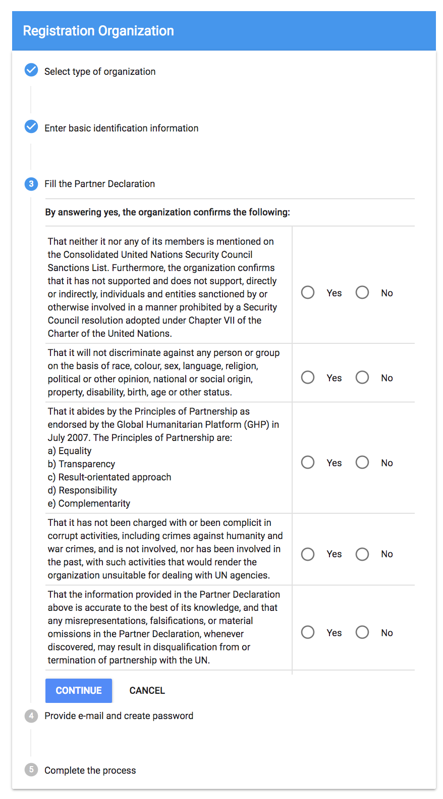
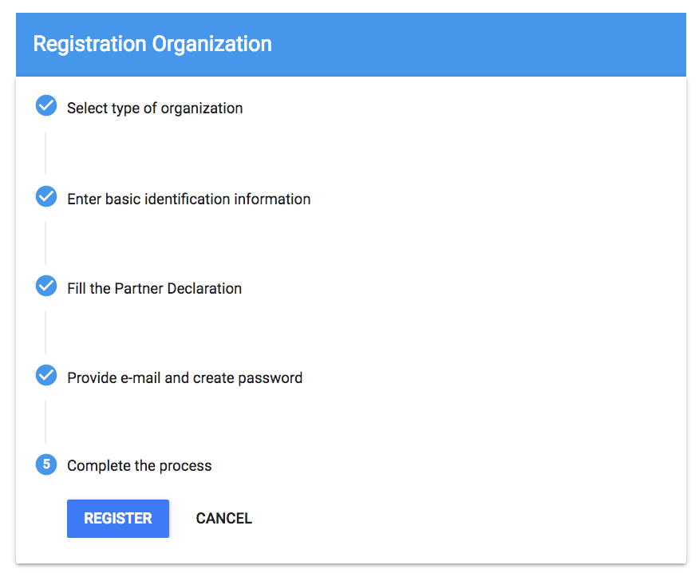
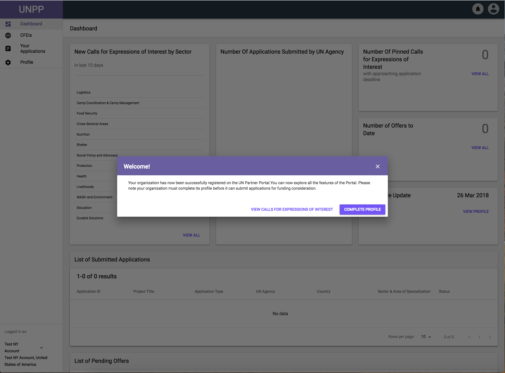

# Registration

### **Agency Registration Process:**

Currently, in order to access the portal and create an account, an Administrator from an Agency \(with access\) must first send an invitation by email for the new user to follow through to the login process.

### **Partner Registration Process:**

Partners that would like to access the UNPP will need to follow the registration process available at the login screen.  

The new user needs to click on the “Register” button and fill out an application to register their account with the United Nations.  

Once at the registration screen the user will need to complete 5 sections before completing the registration process:

1. Type of Org
2. Basic ID Info
3. Partner Declaration
4. Provide e-mail & create Password
5. Complete the Process

**Note: If the user is a Country Office under an INGO Org type, they will not be able to create an account until an admin from the INGO Headquarters creates one for them.**

